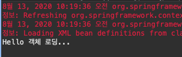
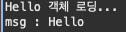
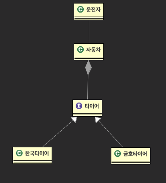
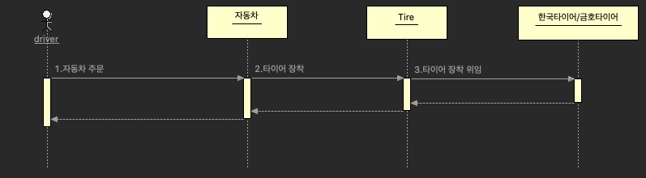

[toc]

# 개요


- src/main/java, src/main/resources 는 패키지 형태로 폴더를 보여주는것이고, 밑은 폴더형태로. 
- .java 파일들은 main의 java폴더에 만듦
- 그 외 xml같은 환경설정 파일들은 resources 폴더에 만듦
- Spring의 목적은 규모가 큰 프로젝트를 여러명이 유지보수를 하며 몇년간 쓰기위한 프로젝트를 만들기 위함이다. 3년차 5년차 등 개발자들이 손쉽게 유지보수할 수 있도록.
- 순수 자바로만 구성된 웹 프로젝트. 이를 위해 폴더를 구분해주는것이다.
- Test 폴더 : 하나하나의 단위들이 잘 작동하는지 확인하기위한 폴더. deploy와는 아무 상관이 없다. 개발자가 자기 코드를 테스트하기위한 용도로만. 


## Dependency 추가

- maven에선 repository를 이용해 자바에서 필요한 모든 jar 파일들을 받을 수 있다. JSTL 등 라이브러리를 사용할때 지금까진 다 찾아서 다운받았는데, maven은 repository만 복사붙여넣기하면 모두 사용 가능.
- 우리가 계속 jar 파일을 build path 로 추가해준것처럼, 그것 대신 maven에선 우리가 만들었던 maven-repository 에서 가져다가 알아서 build path 해준다. 
- 그래서 spring은 오프라인보다 온라인에서 의미가 있다. maven-repository가 인터넷을 통해 다운받아지기때문. 
- pom.xml 과 관련있다.


- 우리는 Spring 4.3.28 버전을 사용할 것. 
- Release 버전 : 배포판. 이미 검정이 다 됬다는것. Debug 버전은 아직 문제있음.


- Dependencies 에 추가하고 저장하면 알아서 다운받아짐.
- 이래서 인터넷이 안되면 안됨.
- dependencies 밑에 dependency가 계속 추가되는것.


- 깔고나면 maven-repository에 붙어진걸 확인
  - 경로 : 로컬 repository / <groupId명> / <artifactId명> / <version명>
- 이클립스에선 Maven Dependencies에 붙음 


# Spring으로 개발하기

spring 자체가 디자인패턴들 다 가지고 있다. Di와 AOP 모두 의존성 주입의 개념이다. 

## DI 

- 객체 주입 (전략패턴)

## AOP

- 코드 주입 (프록시패턴)


## IoC(의존역전, 제어역행), DI(Dependency Injection, 의존주입)

- A, B, C, D를 따로 만들고 E를 결합해 완제품을 만들고싶다.

- 내가 F가 필요하면 A, B, D만 갖고오면 되고. 

- 지금까진 객체가 필요하면 내가 만들었다. 예를들어 BoardDAO가 오라클로 구성되있는데, mySQL로 바뀌면서 이름이 BoardDAO-1 이런식으로 바꾸게 된다. 그럼 개발자가 이름을 전부 다 바꿔야하게된다. 오직 부품 하나가 바꼈을 뿐인데 그것때문에 개발자가 만들어야될 인스턴스 객체 이름을 다 변경해줘야한다. 

- 이제는 개발자가 직접 new 하는게 아니라 외부에서, 내가 오라클 객체가 필요하면 new로, mySQL이 필요하면 new로 나한테 쓰라고 넘겨준다. 오! 이 객체 날라왔구나! 이 정보를 통해 CRUD를 하게됨. 

- 그렇게되면 dao간 메소드 이름이 같아야함 -> 상속관계 이용

- 항상 변화에 둔감하게 만들어야한다.

- 그래서 실제 객체를 생성하는 행위를 Spring에서는 개발자가 아니라 스프링 자체가 한다. 

- 객체를 컨테이너에 만들어놓고 개발자가 필요할때마다 가져다 쓰게되고, 이를 IoC라 한다.

- 주입방식

  - 생성자 주입
  - 속성 주입 (setter 주입)

- "컨트롤러 객체는 dao 객체를 주입받아 사용하려한다." => 컨트롤러 객체가 없으면 프로그램을 실행할 수 없다. (의존성)

- mvc02에서 리스너에서 dao 객체를 만들고 context 에서 가져다 쓴것도 일종의 의존성 주입 & 싱글턴 패턴.

  

### 컨테이너

: spring은 자체에서 프로그램실행시 필요한 객체들을 도도도도 만들어놓고 보관하는곳. bean 클래스를 관리(생성, 삭제 등)하는 주체. 

- bean : 객체 하나 하나를 뜻함.
  - ex) <bean class="java.util.Random"></bean> 이런식으로 xml파일에 Random 클래스 객체를 만들 수 있음.
  - spring 서버가 실행될때 xml에 만들어놓은 객체들을 컨테이너에 다 생성해놓음.
- Container 의 종류중 ApplicationContext가 주로 쓰임
  - `ClassPathXmlApplicationContext` : 클래스 패스로부터 읽어들여 객체 관리 (스프링에서부터 지정된 경로까지)
  - `FileSystemXmlApplicationContext` : 파일 경로를 통해 xml 읽어와서 컨테이너에 객체 관리 (파일의 모든 경로)
- 객체 유지보수시 xml 파일만 건들면 되게된다. => 이것마저 유지보수가 힘들다고 생각이 되어 어노테이션같은 방식이 나타나게 된다.
  - ex) 내가 객체가 백개 필요하면 bean 객체가 100개 필요함. 비효율적.
  - annotation을 이용하면 xml을 고쳐서 알아서 100개의 객체를 자동으로 만들어준다. 
- 현재 : annotation마저 비효율적이었다. 차라리 xml을 없애버리고 순수 자바 문법으로만 컨테이너를 구현해보자! 스타트업같은데서 꽤 쓰는 방법. 


### BeanFactory VS ApplicationContext

- BeanFactory : 해당 객체가 호출되기 전까지 안만들고있다가 필요해서 호출하는순간 xml을 읽어다가 객체 생성. 그 후 호출시 이미 만들어진 객체를 반환. 
  - Ex) xml에 BoardDAO, MemberDAO가 있으면 main메소드에서 BoardDAO 객체를 처음 호출하면 boardDAO 객체만 호출시 생성되고 memberDAO는 호출될때까지 안만든다.
- ApplicationContext 컨테이너 : xml을 읽는순간 xml에 bean 으로 선언한 객체들을 모두 만들어 컨테이너에 보관. 
  - ex) xml 파일 로딩시 boardDAO, memberDAO 다 일단 만들어놓음. 
  - but, ApplicationContext에서는 이 방식이 비효율적일수도 있기 때문에 옵션을 줘서 호출될때만 객체가 생성되게 할수도 있다. 


# Basic


- pom.xml 에서 사용할 수 있는 키워드들은 `xmlns=*"http://maven.apache.org/POM/4.0.0"* xmlns:xsi=*"http://www.w3.org/2001/XMLSchema-instance"* xsi:schemaLocation=*"http://maven.apache.org/POM/4.0.0 https://maven.apache.org/xsd/maven-4.0.0.xsd"*` 가 갖고있다. 그래서 규약이 안된 태그는 인식하지 못한다.
- Bean 태그를 쓰고싶으면 bean도 약속이 되있어야한다. 

beanContainer.xml

```java
<?xml version="1.0" encoding="UTF-8"?>
<beans xmlns="http://www.springframework.org/schema/beans" 
       xmlns:xsi="http://www.w3.org/2001/XMLSchema-instance" 
       xsi:schemaLocation="http://www.springframework.org/schema/beans 
                           http://www.springframework.org/schema/beans/spring-beans.xsd ">
</beans>
```

- 약속된놈들을 불러온다. 

```java
public class HelloMain {
	
	public static void main(String[] args) {
		
		// classPath에서부터 읽어옴. src/main/resources 부터. 
		new ClassPathXmlApplicationContext("beanContainer.xml");
	}
}
```


- main에서 `ClassPathXmlApplicationContext` 로 방금 만든 beanContainer.xml 호출하면 읽어오는것 확인. 


## 객체생성

```java
<!-- Hello hello = new Hello() 객체 만들어보기 -->
    <bean class="basic.Hello" />
```

```java
package basic;

public class Hello {

	private String msg;
	
	public Hello() {
		System.out.println("Hello 객체 로딩...");
		msg = "Hello";
	}
	
	public void prnMsg() {
		System.out.println("msg : " + msg);
	}
}

```




- new 메소드 없이도 객체 생성됨.
- bean이 두개라면 같은 객체가 두개 생성됨.


1. ClassPathXmlApplicationContext & 객체 구분자 : id

```java
<!-- Hello hello = new Hello() 객체 만들어보기 -->
    <bean class="basic.Hello" id="hello"/>
```

- id 값 주기

```java
public static void main(String[] args) {
		
		// classPath에서부터 읽어옴. src/main/resources 부터. 
		ApplicationContext context = new ClassPathXmlApplicationContext("beanContainer.xml");
		// id가 hello인 객체를 가져옴 
		Hello obj = (Hello)context.getBean("hello");
		obj.prnMsg();
	}
```



```java
<bean class="basic.Hello" id="hello"/>
 <bean class="basic.Hello" id="hello2"/>
```

- id로 같은 클래스의 다른 객체 구분 가능 


2. FileSystemXmlApplicationContext

```java
// FileSystemXmlApplicationContext : 파일의 절대경로에서 xml을 가져옴 
		ApplicationContext context = new FileSystemXmlApplicationContext("src/main/resources/beanContainer.xml");
		
		// id가 hello인 객체를 가져옴 
		Hello obj = (Hello)context.getBean("hello");
		obj.prnMsg();
		
		Hello obj2 = (Hello)context.getBean("hello2");
		obj2.prnMsg();
```


3. GenericXmlApplicationContext

- FileSystem 방식에서 맨날 일일히 써주기 귀찮아서 classpath: 사용

```java
ApplicationContext context = new GenericXmlApplicationContext("classpath:beanContainer.xml");
```

- classpath 안써줘도 나옴.


4. Lazy-init : true

- get 으로 누가 원할때만 객체를 만들어라. 
- Lazy-init("true") 하고 실행하면 호출을 안하면 객체를 안만듦.

```java
<bean class="basic.Hello" id="hello" lazy-init="true"/>
    <bean class="basic.Hello" id="hello2" lazy-init="true"/>
```


5. 싱글턴

- 생성자를 private으로 해도 객체가 만들어질때마다 생성자가 호출되어 싱글턴이 안먹힘.
- 이때, beanContainer에서 `factory-method="getInstance"` 속성을 추가해줌으로서 생성자 대신 HelloSingle의 `getInstance` 메소드를 호출하도록 한다. 

```java
<bean class="basic.HelloSingle" id="hs" factory-method="getInstance"></bean>
<bean class="basic.HelloSingle" id="hs2" factory-method="getInstance"></bean>
```

```java
public class HelloSingle {

	private static HelloSingle instance = null;
	private String msg = "안녕 난 싱글턴이야...";
	
	// 외부에서 new 할 수 없으므로 하나만 만들어 싱글턴 패턴으로 계속 쓰려함 
	private HelloSingle() {
		System.out.println("HelloSingle 객체 로딩...");
	}
	// 객체가 이미 있으면 있는 객체를, 없으면 새로 만들어 반환 
	public static HelloSingle getInstance() {
		if(instance == null) 
			instance = new HelloSingle();
		return instance;
	}
	
	public void prnMsg() {
		System.out.println("msg : " + msg);
	}
}
```

```java
public class HelloMain {
	
	public static void main(String[] args) {
		
		ApplicationContext context = new 		     GenericXmlApplicationContext("classpath:beanContainer.xml");
		
		HelloSingle obj3 = (HelloSingle)context.getBean("hs");
		HelloSingle obj4 = (HelloSingle)context.getBean("hs2");
		obj3.prnMsg();
		System.out.println(obj3);
		System.out.println(obj4);
  }
}
```


- 결과를 보면 obj3와 obj4가 같은 주소값을 가짐. 같은 객체가 반환됨.


cf) 매번 명시적 형변환 해주기 귀찮다면 generic을 써봐!

```java
HelloSingle obj3 = context.getBean("hs", HelloSingle.class);
```

=> HelloSingle 클래스 형으로 객체를 만들겠다


# DI (의존주입)

- 합성이나 집약관계를 가지고있다는건 의존성을 갖고있다는것이다.



- 타이어가 없으면 자동차가 안굴러가니 합성관계. 의존성이 나타나는 부분이다. 

```java
public class Car {

	private Tire tire;		// 의존관계 발생 
	
	public Car() {
		// 의존관계 설정 
//		tire = new HankookTire();
		tire = new KumhoTire();
	}
	
	public void prnTireBrand() {
		System.out.println("장착된 타이어 : " + tire.getBrand());
	}
}
```

```java
public interface Tire {

	// 타이어의 브랜드만 궁금함 
	public String getBrand();
}
```

```java
public class HankookTire implements Tire {

	public String getBrand() {

		return "한국타이어";
	}
}
```

```java
public class KumhoTire implements Tire {

	public String getBrand() {
		return "금호타이어";
	}
}
```

```java
public class DriverMain {

	public static void main(String[] args) {
		
		Car car = new Car();
		car.prnTireBrand();
	}
}
```

=> Car에서 브랜드를 바꿔줄때마다 바꿔짐. Car과 tire 간의 의존관계. 불편함.


- 시퀀스 다이어그램

cf) 어느 시점에 어떤 작업을 어느 과정으로 할 것인지 명시. 개발자들끼리 서로 개발에 대한 얘기를 할 때 시퀀스 다이어그램 많이씀. 


## 생성자 주입 (Constructor Injection)

- 이젠 객체를 개발자가 그때그때 만들지 않고, 외부에서 받아오겠다.

```java
public class Car {

	private Tire tire;		// 의존관계 발생 
	
	/*
	public Car() {
		// 의존관계 설정 
//		tire = new HankookTire();
		tire = new KumhoTire();
	}
	*/
  
	// 생성자 주입 (Constructor Injection)
	public Car(Tire tire) {
		this.tire = tire;
	}
	
	public void prnTireBrand() {
		System.out.println("장착된 타이어 : " + tire.getBrand());
	}
}
```

```java
public class DriverMain {

	public static void main(String[] args) {
		
		Tire tire = new HankookTire();
		
		Car car = new Car(tire);
		car.prnTireBrand();
	}
}
```


- 의존관계를 가진 car와 tire 객체간의 결합이 떨어지게 된다. car라는 클래스의 코드를 수정할일이 없기때문.


## 속성 주입 / Setter 주입

```java
public class Car {

	private Tire tire;		// 의존관계 발생 
	
	
	public Car() {
		// 의존관계 설정 
//		tire = new HankookTire();
//		tire = new KumhoTire();
	}
	
	
	// 생성자 주입 (Constructor Injection)
	public Car(Tire tire) {
		this.tire = tire;
	}
	// 속성 주입 / setter 주입 (Setter Injection)
	public void setTire(Tire tire) {
		this.tire = tire;
	}
	
	public void prnTireBrand() {
		System.out.println("장착된 타이어 : " + tire.getBrand());
	}
}
```

```java
public class DriverMain {

	public static void main(String[] args) {
		
//		Tire tire = new HankookTire();
		Tire tire = new KumhoTire();
		
		// 1. 생성자 주입 
//		Car car = new Car(tire); 
		
		// 2. setter 주입 
		Car car = new Car();
		car.setTire(tire);
		car.prnTireBrand();
	}
}
```

- 생성자 대신 Car의 setter 메소드를 통해 tire 멤버변수를 주입 

- 이 DI 기술을 이제 컨테이너에 적용해야한다.


# Spring에서의 DI

## setter주입

- 생성자 주입보단 세터 주입이 더 많이 쓰인다.

- 각 bean 간의 의존관계 설정을 xml 파일에 등록 
- 프로그램 코드에서는 직접 new를 할 필요가 없게된다. 

```java
 <bean class="di.xml.n01.Car" id="car"></bean>
 <bean class="di.xml.n01.HankookTire" id="tire"></bean>
```

```java
public class DriverMain {

	public static void main(String[] args) {
		
		
		ApplicationContext context = new GenericXmlApplicationContext("di-xml01.xml");
		
		Car car = (Car)context.getBean("car");
		Tire tire = (Tire)context.getBean("tire");
		car.setTire(tire);
		
		car.prnTireBrand();
		
		/*
		// 방법 1
		Car car = new Car();
		
		Tire tire = new HankookTire();
		car.setTire(tire);
		
		car.prnTireBrand();
		*/
	}
}

```


- 근데, Car에서 계속 멤버변수로 tire를 선언해줌으로서 의존관계를 맺어주기 귀찮으니 xml에서 의존관계를 정의하고싶다!

```java
<beans xmlns="http://www.springframework.org/schema/beans" 
      xmlns:xsi="http://www.w3.org/2001/XMLSchema-instance" 
      xsi:schemaLocation="http://www.springframework.org/schema/beans 
                        http://www.springframework.org/schema/beans/spring-beans.xsd ">
    // 방법 1
    <bean class="di.xml.n01.Car" id="car"></bean>
    <bean class="di.xml.n01.HankookTire" id="tire"></bean>
    
    // 방법 2
    <bean class="di.xml.n01.HankookTire" id="hankook"></bean>
    <bean class="di.xml.n01.KumhoTire" id="kumho"></bean>
    
    <bean class="di.xml.n01.Car" id="car2">
    	<property name="tire" ref="kumho"></property>
    </bean>
    
</beans>
```

- property : set과 같은 의미 
- ref : id가 kumho인 객체를 setter로 주입시킬꺼야!
- 이렇게 되면 car 인스턴스 변수를 만들면서 세터까지 만들어짐. 
- 내가 금호 말고 한국 타이어를 끼겠다! 하면 ref="hankook" 만 바꿔주면 됨. 자바코드를 수정할 필요가 없음. 


## 생성자 주입

-  <**bean** class=*"di.xml.n02.Car"* id=*"car"*></**bean**> 이렇게만 입력하고 실행하게되면 기본생성자만 호출되기때문에 우리가 생성자의 매개변수를 통해 주입할수가 없게된다. 
- `<constructor-arg>` 태그를 사용하여 생성자 주입

```java
<beans xmlns="http://www.springframework.org/schema/beans" 
      xmlns:xsi="http://www.w3.org/2001/XMLSchema-instance" 
      xsi:schemaLocation="http://www.springframework.org/schema/beans 
                        http://www.springframework.org/schema/beans/spring-beans.xsd ">
    <bean class="di.xml.n02.HankookTire" id="hankook"></bean>
    <bean class="di.xml.n02.KumhoTire" id="kumho"></bean>
    
    <bean class="di.xml.n02.Car" id="car">
    	<constructor-arg ref="hankook"></constructor-arg>
    </bean>
</beans>
```

```java
public class DriverMain {

	public static void main(String[] args) {
		
    // 이 단계에서 이미 xml에서 정의한 생성자 주입이 일어난다. 
		ApplicationContext context = new GenericXmlApplicationContext("di-xml02.xml");
		
		Car car = (Car)context.getBean("car");
		car.prnTireBrand();
		
		/* 이렇게 했던 생성자 주입 방식을 xml을 이용해 Spring으로 하고싶다 
		Tire tire = new HankookTire();
		Car car = new Car(tire);
		car.prnTireBrand();
		*/
	}
}
```


- 만약 내가 앞타이어 뒷타이어 브랜드를 다르게 하고싶다면?

```java
<bean class="di.xml.n02.Car" id="car2">
    	<constructor-arg ref="hankook" index="0"></constructor-arg>
    	<constructor-arg ref="kumho" index="1"></constructor-arg>
    </bean>
```

- index는 안써줘도 순서대로 나오지만, 만약 내가 순서를 바꿔주고싶으면 인덱스를 바꿔주면 됨. => 한국 : 금호 

```java
<bean class="di.xml.n02.Car" id="car2">
    	<constructor-arg ref="hankook" index="1"></constructor-arg>
    	<constructor-arg ref="kumho" index="2"></constructor-arg>
    </bean>
```

=> 금호 : 한국 


- 만약 Tire, String 두개로 의존성을 주입하고싶다면?

```java
<bean class="di.xml.n02.Car" id="car3">
    	<constructor-arg ref="kumho"></constructor-arg>
    	<constructor-arg value="hello"></constructor-arg>
    </bean>
```


# annotation

- 주입하는 객체를 갈아끼울때마다 xml 방식은 계속 xml 파일에서 ref="" 값을 바꿔줘야함. 이름 한번 잘못쓰면 에러나고 잡기 힘듦. 
- 어노테이션 : 자동으로 생성자, 속성 주입이 일어날 수 있도록 
- 컨테이너에서 주입할 수 있는 대상이 생기면 알아서 주입된다. 
- 그래서 한국타이어를 따로 주입시켜주지않아도 알아서 객체를 주입해준다. 
- annotation을 이용하면 xml에 bean 태그가 없어진다.
- prefix를 붙이는 이유 : 이것은 이 xml에 대한 규약을 지키는 아이야! 라는걸 나타내기 위해. 
  - 우리가 xml beans 설정할 때 xmlns:context, xmlns:xsi, xsi:schemaLocation 세개를 정의해줘야했다. 이 중 xmlns:context 설정을 해준것이 context 에 저장되고, 같은 context를 쓰겠다는 의미에서 `<context:annotation-config />` 를 붙여준다. 
  - schemaLocation : 니가 지금 참조하려는 규약조건은 이 url에 있어! 
  - context : 이 url에 있는 이 규칙을 이용해서 작성해!
  - annotation은 xmlns:context에 들어있기때문에 context:annotation 이렇게 prefix를 붙여야 에러가 안난다. 


## Autowired

Spring Framework가 만든 어노테이션

- 붙일 수 있는 형태
  - 변수
  - 생성자
  - set 메소드


```java
<beans xmlns="http://www.springframework.org/schema/beans"
	   	 xmlns:context="http://www.springframework.org/schema/context"
		   xmlns:xsi="http://www.w3.org/2001/XMLSchema-instance"
		   xsi:schemaLocation="http://www.springframework.org/schema/beans 
							http://www.springframework.org/schema/beans/spring-beans.xsd
							http://www.springframework.org/schema/context
							http://www.springframework.org/schema/context/spring-context.xsd ">
	<context:annotation-config />		
	
	<bean class="di.anno.n01.HankookTire" id="hankook"></bean>
	<bean class="di.anno.n01.Car" id="car"></bean>					
</beans>
```

```java
// 생성자 주입 (Constructor Injection)
	@Autowired
	public Car(Tire tire) {
		this.tire = tire;
		System.out.println("Car(Tire) 호출...");
	}
// 속성 주입 / setter 주입 (Setter Injection)
	@Autowired
	public void setTire(Tire tire) {
		this.tire = tire;
	}
```

- 원래 방식대로 xml에 객체 추가하고 ApplicationContext로 컨테이너를 생성하면 기본 생성자만 호출됨. 
- 자동 속성 주입을 하기위해 세터 메소드에 @Autowired 어노테이션 추가.
- 그러면 어떤 타이어를 주입할건지 명시하지 않아도 객체 정의한 타이어가 하나밖에 없으니 자동으로 한국타이어로 들어감

```java
public class Car {

	@Autowired
	private Tire tire;		// 의존관계 발생 
	
	
	public Car() {
		System.out.println("Car() 호출...");
	}
	
	
	// 생성자 주입 (Constructor Injection)
//	@Autowired
	public Car(Tire tire) {
		this.tire = tire;
		System.out.println("Car(Tire) 호출...");
	}
	
	// 속성 주입 / setter 주입 (Setter Injection)
//	@Autowired
	public void setTire(Tire tire) {
		this.tire = tire;
	}
	
	public void prnTireBrand() {
		System.out.println("장착된 타이어 : " + tire.getBrand());
	}
}
```

- 변수에도 어노테이션을 설정해 기본 생성자만 호출해도 주입이 된다. 


- Autowired에서 객체를 찾는 우선순위 

  1. type matching : 타입이 맞는 애를 먼저 찾는다. 만약 타입이 맞는 애가 하나뿐이라면 걔를 주입한다. xml 파일에 id 속성이 없어도 작동한다. 타입을 가지고 매칭하기때문.
  2. name matching : 타입 맞는 애가 여러명이라면 이름 매칭을 한다. id로 찾는다. 

  - 이름을 정의 안해줬는데 타입이 매칭되는 타이어가 두개기때문에 에러가 저렇게 나온다. 나는 하나만 매칭해야되는데, 두개야!


```java
No qualifying bean of type 'di.anno.n02.Tire' available: expected single matching bean but found 2: hankook,kumho
```


### Qualifier


- @Qualifier("") : 타입이 맞는 객체가 여러개일경우 name matching을 하려고 이름을 명시해주는것. 

  - ""라는 이름의 애를 넣어줘! 

  ```java
  @Autowired
  	@Qualifier("hankook")
  	private Tire tire;		// 의존관계 발생 
  ```


- @Autowired(required = false)
  - 꼭 의존주입을 해야되는건 아니야! 해당하는 타입의 객체가 없을시 에러나지 말고 그냥 Null을 주입 


```java
// 생성자 주입 (Constructor Injection)
	@Autowired
	public Car(@Qualifier("kumho") Tire tire) {
		this.tire = tire;
		System.out.println("Car(Tire) 호출...");
	}
	
	// 속성 주입 / setter 주입 (Setter Injection)
//	@Autowired
	public void setTire(Tire tire) {
		this.tire = tire;
		System.out.println("set(Tire) 호출...");
	}
```

- 생성자주입의 경우 파라미터에 qualifier를, 속성주입의 경우 메소드 앞에 써준다.


- cf) 만약 넥슨타이어 클래스를 만들고  Tire를 상속받지 않은채 실행하게되면 type matching으로 넥슨타이어를 인식하지 못한다. 


## resource

순수 자바가 가지고있는 어노테이션

- 붙일 수 있는 형태
  - 변수
  - set 메소드 

- autowired 와 똑같은 기능이지만 **생성자엔 못한다.** 

```java
public class Car {

//	@Autowired
	@Resource
	private Tire tire;		// 의존관계 발생 
	
	
	public Car() {
		System.out.println("Car() 호출...");
	}
	
	
	// 생성자 주입 (Constructor Injection)
//	@Autowired
	public Car(Tire tire) {
		this.tire = tire;
		System.out.println("Car(Tire) 호출...");
	}
	
	// 속성 주입 / setter 주입 (Setter Injection)
//	@Autowired
	@Resource
	public void setTire(Tire tire) {
		this.tire = tire;
	}
	
	public void prnTireBrand() {
		System.out.println("장착된 타이어 : " + tire.getBrand());
	}
}
```


- 매칭하는법

  1. name matching : 이름매칭 먼저. 
  2. type matching : 이름에 해당하는 애가 없으면 타입매칭 

  - NexenTire 가 tire형이 아닌데 resource 방식은 name matching으로 id=tire를 먼저 보기때문에 NexenTire를 먼저 보고, 그 후 타입이 안맞다는 에러를 출력.

  ```java
  public class Car {
  
  	@Resource
  	private Tire tire;		// 의존관계 발생 
  	
  	
  	public Car() {
  		System.out.println("Car() 호출...");
  	}
  	
  	
  	// 생성자 주입 (Constructor Injection)
  	public Car(Tire tire) {
  		this.tire = tire;
  		System.out.println("Car(Tire) 호출...");
  	}
  	
  	// 속성 주입 / setter 주입 (Setter Injection)
  //	@Resource
  	public void setTire(Tire tire) {
  		this.tire = tire;
  		System.out.println("set(Tire) 호출...");
  	}
  	
  	public void prnTireBrand() {
  		System.out.println("장착된 타이어 : " + tire.getBrand());
  	}
  }
  
  ```

  ```java
  <bean class="di.anno.n03.HankookTire" id="hankook"></bean>
  <bean class="di.anno.n03.KumhoTire" id="kumho"></bean>
  <bean class="di.anno.n03.NexenTire" id="tire"></bean>
  <bean class="di.anno.n03.Car" id="car"></bean>		
  ```

  ```java
  Bean named 'tire' is expected to be of type 'di.anno.n03.Tire' but was actually of type 'di.anno.n03.NexenTire'
  ```


## @Value

- @Value("") 
  - 생성자에 기본자료형을 주입할때 setter말고 annotation으로 값을 집어넣고 싶을때. 

```java
@Autowired
public MyCalculator(@Value("12")int firstNum, @Value("5")int secondNum, Calculator calculator) {
		super();
		this.firstNum = firstNum;
		this.secondNum = secondNum;
		this.calculator = calculator;
	}

```

```java
<context:annotation-config />
<bean class="di.test02.Calculator" id="cal"></bean> 
<bean class="di.test02.MyCalculator" id="myCal"></bean>
```

- 이렇게되면 xml을 최소한으로 건들 수 있게됨
- @Value 를 사용하려면 @Autowired가 선행되어야함. 


# Dependency 응용

- 집합객체에 대한 의존성을 갖게하고싶다.
- collection은 기본 자료형과 주입시 사용하는 태그가 다르다.


## list

```java
package di.collection;

import java.util.List;

public class ListAddress {

	private List<String> address;

	public ListAddress() {};
	
	public ListAddress(List<String> address) {
		super();
		this.address = address;
	}

	public List<String> getAddress() {
		return address;
	}

	public void setAddress(List<String> address) {
		this.address = address;
	}
	
	
}

```

```java
public class ListMain {

	public static void main(String[] args) {
		
		// spring
		ApplicationContext container = new GenericXmlApplicationContext("di-collection01.xml");
		
//		ListAddress list = container.getBean("list", ListAddress.class);
		ListAddress list = container.getBean("list02", ListAddress.class);
		
		for(String addr : list.getAddress()) {
			System.out.println(addr);
		}
  }
```

```java
	<bean class="di.collection.ListAddress" id="list">
		<property name="address">
			<list>
				<value>서울시 서초구</value>
				<value>경기도 광명시 철산동</value>
				<value>부산광역시 동구</value>
			</list>
		</property>
	</bean>					

	<bean class="di.collection.ListAddress" id="list02">
		<constructor-arg>
			<list value-type="java.lang.String">
				<value>서울시 서초구</value>
				<value>경기도 광명시 철산동</value>
				<value>부산광역시 동구</value>
			</list>
		</constructor-arg>
	</bean>
```


- value-type="java.util.String" : 안쓴다고 안나오는건 아니지만 이렇게 타입을 정해줄수도 있다. 


## map

```java
package di.collection;

import java.util.Map;

public class MapAddress {

	private Map<String, String> address;
	
	public MapAddress() {}

	
	public MapAddress(Map<String, String> address) {
		super();
		this.address = address;
	}


	public Map<String, String> getAddress() {
		return address;
	}

	public void setAddress(Map<String, String> address) {
		this.address = address;
	}
	
	
}

```

```java
<bean class="di.collection.MapAddress" id="map">
		<property name="address">
			<map>
				<entry>
					<key><value>홍길동</value></key>
					<value>서울시 서초구</value>
				</entry>
				<entry>
					<key><value>강길동</value></key>
					<value>경기도 광명시 철산동</value>
				</entry>
				<entry>
					<key><value>윤길동</value></key>
					<value>경기도 성남시 분당구</value>
				</entry>
			</map>
		</property>
	</bean>		
```

```java
public class MapMain {

	public static void main(String[] args) {
		
		ApplicationContext context = new GenericXmlApplicationContext("di-collection02.xml");
		
		MapAddress map = context.getBean("map", MapAddress.class);
		
		Map<String, String> addrs = map.getAddress();
		
		Set<Entry<String, String>> address = addrs.entrySet();
		
		for(Entry<String, String> a : address) {
			System.out.println(a.getKey() + " : " + a.getValue());
		}
	}
}

```


- key값도 String이기때문에 value 태그를 붙여줘야함.


# component-scan

- 해당 하위 패키지 내의 클래스 위에 정의된 어노테이션을 검색하며 bean 객체를 만든다.
- @Component, @Controller, @Service, @Repository 어노테이션이 달린 클래스의 객체는 자동으로 컨테이너에 등록한다.
  - @Controller : 요청 uri에 대한 비즈니스 로직을 수정하는 클래스
  - @Repository : DB에 억세스하는 DAO 클래스
  - @Service : ui와 dao 사이에 뿌려주는 중간에 비즈니스 로직을 수행하는 service 클래스 
    - service의 필요성 : 서로 다른 테이블을 다 봐야하는 리퀘스트의 경우 컨트롤러에서 길게 쓰는것보다 boardDAO를 갔다가 MemberDAO를 가는 로직을 서비스에서 구현해줌. 
    - 컨트롤러는 작업을 해서 결과만 가져가는 형태고, 실제 그 안의 로직은 서비스가. 
  - @Component : vo같은애들. 하지만 객체를 만들 일이 많진 않다. 하나의 단위같은 객체. 

```java
@Component
public class MyCalculator {
}
@Service
public class Calculator {
}
```


- MyCalculator가 의존적인 아이니까 Component, Calculator는 서비스, 레포지토리 등 아무거나 붙여도 됨. 

```java
<context:component-scan base-package="di.test03"></context:component-scan>
```

- `context:component-scan` 을 이용해 패키지를 스캔하며 컨테이너에 넣겠다고 선언.
- `base-package` 를 이용해 스캔할 패키지 경로 입력 

```java
public class UserMain {

	public static void main(String[] args) {
		
		// 스프링 방식 
		ApplicationContext context = new GenericXmlApplicationContext("ditest03/beanContainer.xml");
		
		MyCalculator my = (MyCalculator)context.getBean("myCalculator");

		my.add();
		my.sub();
		my.mul();
		my.div();
	}
}
```

- component-scan을 이용해 할 경우 클래스 id가 자동으로 클래스 이름 맨 앞자리가 소문자로 변한 이름으로 등록됨. 
- 내가 정의한 이름으로 등록하고싶으면 @Component("myCal")
- component-scan은 autowired와 상관 없이 패키지를 스캔해 컨테이너에 올리는것.


# @Configuration

- <bean></bean> 의 xml 대신 자바코드로 하고싶을때 
- config 파일을 읽으면서 그 안에 정의된 객체들을 만들게하고싶다 
- @Bean : <bean> 과 같은 역할
- `AnnotationConfigApplicationContext` : config 파일 안에 내용들을 가지고 객체를 만드는 메소드 

```java
@Configuration
public class Config {

//	@Bean(name="car")
	@Bean
	public Car car() {
		return new Car();
	}
	@Bean
	public Tire hankookTire() {
		return new HankookTire();// 메소드 이름은 중요치 않고, 얘를 컨테이너에 올린다.
	}

}
```

```java
public class Car {

	@Autowired
	private Tire tire;		// 의존관계 발생 
	
	
	public Car() {
		System.out.println("Car() 호출...");
	}
	
	
	// 생성자 주입 (Constructor Injection)
//	@Autowired
	public Car(Tire tire) {
		this.tire = tire;
		System.out.println("Car(Tire) 호출...");
	}
	
	// 속성 주입 / setter 주입 (Setter Injection)
//	@Autowired
	public void setTire(Tire tire) {
		this.tire = tire;
		System.out.println("set(Tire) 호출...");
	}
	
	public void prnTireBrand() {
		System.out.println("장착된 타이어 : " + tire.getBrand());
	}
}
```

```java
public class DriverMain {

	public static void main(String[] args) {
		
		ApplicationContext context = new AnnotationConfigApplicationContext(Config.class);
		
		Car car = context.getBean("car", Car.class);
		
		car.prnTireBrand();
	}
}
```


- 만약 타이어가 두개라면 Qualifier로 지정해줘야함.

```java
@Bean(name="kumho")
	public Tire kumhoTire() {
		return new KumhoTire();
	}
```

```java
@Autowired
	@Qualifier("kumho")
	private Tire tire;		// 의존관계 발생 
```


- 그런데 이마저도 @bean이 너무많이 늘어남. `component-scan`을 쓰자 

```java
@ComponentScan(basePackages = {"di.java"}) // di.java에 있는 모든 객체를 스캔하여 컨테이너에 담기 
@Configuration
public class Config {
}
```

```java
@Component
public class Car {

	@Autowired
	@Qualifier("hankook")
	private Tire tire;		// 의존관계 발생 
}
```

```java
@Component("hankook")
public class HankookTire implements Tire {

	public HankookTire() {
		System.out.println("HankookTire() 호출...");
	}
	public String getBrand() {

		return "한국타이어";
	}
}
```

- 이때 Car 클래스에서 Qualifier로 tire의 형을 hankook이라고 줬는데, `component-scan` 은 자동으로 클래스이름 맨 앞자리가 소문자로만 된 형태로 생기기때문에 `@Component("hankook")` 으로 HankookTire 객체의 id를 hankook이라고 해줘야함.
- `@ComponentScan` 을 쓰려면 내가 객체를 만들고자 하는 클래스에 `@Component` 를 붙여야함. 
- `@Configuration` 은 Config 클래스에 객체마다 다 @Bean 으로 등록해줘야함
- 여기서 한 `@ComponentScan` 가 xml에서 태그로 해준 `Component-scan` 과 같은 의미


# AOP (Aspect Oriented Programming)(관점지향프로그래밍)

## 개요


- ex) 잔액조회, 이체, 공과금납부 각각의 기능이 수행될때마다 먼저 로그를 남기고 보안을 걸은다음에 기능을 수행하고 다시 로그를 남기는 과정을 수행할것이다. 
- 그런데 만약 보안정책이 바뀌면 잔액조회, 이체, 공과금납부의 보안 모두가 바껴야한다. 
- 서로 핵심 기능은 다르지만 그 기능 앞뒤로 공통된 기능이 있으면 단일책임원칙에 위배된다. 그 공통된 기능중 하나가 바뀌면 모두가 바뀌어야되니까. 
- 공통관심사 : 이러한 공통된 기능을 지칭. 
- AOP의 핵심 : 공통관심사와 핵심 코드의 분리. 개발자는 오직 핵심코드만 만들고 나는 공통관심사 코드를 직접 쓰지 않았지만 스프링이 실행하면서 자동으로 코드를 주입함. 이것이 바로 코드주입. 내 코드 어디에도 쓰지않았지만 실행이 됨.
- 핵심코드, 공통코드 만드는 사람이 따로 있기때문에 나는 핵심코드 만들면셔 공통코드에 신경쓸필요 없다. 단일책임원칙.
- spring은 실행시(런타임시) 프록시 객체를 생성해서 공통 기능 추가 
- :star: 프록시 기반으로 실시간으로 움직인다!


- 횡단관심사 : 수평으로 모든 기능이 가지고있는 기능
  - 관심의 분리 : 공통으로 만들어지는 관심사와 핵심 관심사를 분리
- but, 순수 자바로는 만들 수 없는 개념이다. spring에서 aop를 사용할 수 있는 가장 큰 이유는 '프록시'를 사용하기 때문. 
- spring 프록시의 특징 
  - 런타임기반
  - 프록시기반
  - 인터페이스 기반
- 언제, 어느 시점에 공통 코드를 삽입시키느냐가 중요. 


## 예시

- 프로그래머 하루 일과
  - 출근한다
  - 프로그래밍 한다(핵심코드)
  - 퇴근한다
- 디자이너 하루 일과
  - 출근한다
  - 디자인 한다(핵심코드)
  - 퇴근한다

=> 만일 내가 '출근한다' 는 코드를 '출근을합니다' 로 바꾸게되면 모든 '출근한다'를 바꿔야됨. 중복코드의 문제. 

=> 핵심코드와 공통코드를 분리시키고 싶다.


```java
class 공통코드 {
  void 출근() {
  }
  
  void 퇴근() {
  }
}
```


### 자바로 짜보기 

- 클래스마다 핵심코드의 메소드 이름이 같아야 공통코드 시점에 잘 코드를 주입할 수 있음. 이를 위해 인터페이스가 필요. 

```java
// 공통코드는 기능클래스이기때문에 객체가 여러개일 필요 없기 때문에 static 메소드로. 
public class Action {

	public static void gotoOffice() {
		System.out.println("출근합니다....");
	}
	
	public static void getoffOffice() {
		System.out.println("퇴근합니다....");
	}
}
```

```java
public interface Employee {

	void work();
}
```

```java
public class Programmer implements Employee {

	@Override
	public void work() {
		Action.gotoOffice();
		System.out.println("개발을 합니다.");
		Action.getoffOffice();
	}

}
```

```java
public class Designer implements Employee {

	@Override
	public void work() {
		Action.gotoOffice();
		System.out.println("디자인을 합니다.");
		Action.getoffOffice();
	}

	
}
```

```java
public class EmpMain {

	public static void main(String[] args) {
		Employee e = new Programmer();
		e.work();
		
		Employee e2 = new Designer();
		e.work();
	}
}
```


- Spring을 안쓰고 자바로만 짰을땐 코드 주입 기능이 없기때문에 모든 클래스에 직접 공통코드를 삽입해야함.
- 하지만 공통코드는 계속 바뀔텐데 그때마다 모든 클래스의 공통코드를 바꿔줘야하는 불상사가 일어남. 


### Spring 에서  AOP

- `Action` 부분이 `Aspect` 가 된다. 클래스 이름은 상관 없지만 공통 모듈을 가진 이 클래스를 애스펙트라고 한다. 어느 시점에 공통코드를 주입할것인지에 대한 정보를 가지고 있어야 한다. 
- 프록시는 work()가 호출되나 안되나를 지켜보고있다가 work()가 수행되기 전에 공통코드를 수행한다. 
- 외부에서는 안에 프록시가 있는지 없는지 모른다. 프록시는 내가 감시해야될 메소드에 대해 호출되기까지 계속 감시하고있다가 호출되는 순간 호출을 채가서 해당 메소드의 앞이나 뒤에서 임의의 메소드들을 실행하게 만든다. 이것은 실제 호출되어야만 실행되는것이기때문에 런타임 기반.


# Spring MVC


=> ppt 대로 따라했는데도 war 파일로 spring maven 프로젝트를 만드니 에러남. 왜? war파일인데 web.inf 폴더가 없어서. 


- 에러를 없애기위해 교수님 파일서버에서 xml 파일들을 가져와 해당 폴더에 넣어준다.


<web.xml>

```java
<?xml version="1.0" encoding="UTF-8"?>
<web-app xmlns:xsi="http://www.w3.org/2001/XMLSchema-instance" xmlns="http://java.sun.com/xml/ns/javaee" xsi:schemaLocation="http://java.sun.com/xml/ns/javaee http://java.sun.com/xml/ns/javaee/web-app_3_0.xsd" id="WebApp_ID" version="3.0">
  <display-name>spring-mvc</display-name>
  
  <servlet>
  	<servlet-name>dispatcher</servlet-name>
  	<servlet-class>org.springframework.web.servlet.DispatcherServlet</servlet-class>
  	<init-param>
  		<param-name>contextConfigLocation</param-name>
  		<param-value>
  			classpath:config/spring/spring-mvc.xml
  		</param-value>
  	</init-param>
  	<load-on-startup>1</load-on-startup>
  </servlet>
  
  <servlet-mapping>
  	<servlet-name>dispatcher</servlet-name>
	<url-pattern>*.do</url-pattern>  
  </servlet-mapping>
  
  <filter>
  	<filter-name>encodingFilter</filter-name>
  	<filter-class>org.springframework.web.filter.CharacterEncodingFilter</filter-class>
  	<init-param>
  		<param-name>encoding</param-name>
  		<param-value>UTF-8</param-value>
  	</init-param>
  </filter>

  <filter-mapping>
  	<filter-name>encodingFilter</filter-name>
	<url-pattern>/*</url-pattern>  
  </filter-mapping>
  
  <welcome-file-list>
    <welcome-file>index.html</welcome-file>
    <welcome-file>index.htm</welcome-file>
    <welcome-file>index.jsp</welcome-file>
    <welcome-file>default.html</welcome-file>
    <welcome-file>default.htm</welcome-file>
    <welcome-file>default.jsp</welcome-file>
  </welcome-file-list>
</web-app>
```


- 내가 만든 DispatcherServlet이 아니라  spring이 제공하는 놈을 쓰겠다.
- *.do 로 끝나는 모든 요청을 `DispatcherServlet` 이 처리하도록.
- 옛날에 우리가 p roperties 파일에 어떤 do 가 들어오면 어떤 컨트롤러가 처리할것인지를 정의했다. 근데 지금은 객체 생성을 xml에서 할것이기때문에 이러한 환경 설정 xml파일이 classpath 밑의 (src.resources) config 밑의 spring 밑의 spring-mvc.xml 로 지정하겠다.
- filter 클래스도 spring에서 알아서 만들어준다. 

< spring-mvc.xml >

```java
<beans xmlns="http://www.springframework.org/schema/beans"
    xmlns:mvc="http://www.springframework.org/schema/mvc"
    xmlns:context="http://www.springframework.org/schema/context"
    xmlns:xsi="http://www.w3.org/2001/XMLSchema-instance"
    xsi:schemaLocation="http://www.springframework.org/schema/beans   
    http://www.springframework.org/schema/beans/spring-beans.xsd
    http://www.springframework.org/schema/context   
    http://www.springframework.org/schema/context/spring-context.xsd
    http://www.springframework.org/schema/mvc
    http://www.springframework.org/schema/mvc/spring-mvc.xsd">

	<context:component-scan base-package="kr.co.mlec" />
    <mvc:annotation-driven />
	<mvc:default-servlet-handler />
	<mvc:view-resolvers>
		<mvc:jsp prefix="/WEB-INF/web/" suffix=".jsp" />
	</mvc:view-resolvers>

</beans>
```

- annotation-driven = annotation-config (어노테이션을 사용할 수 있게함)
- View-resolver : 요청은 서블릿이, 응답은 jsp가 하기때문에 맨날 .jsp를 쳐주기 귀찮음. 그래서 뷰를 담당하는 모든 파일은 어차피  .jsp로 끝나니 난 안써주겠다고 해주는것. 뷰를 담당하는 jsp 파일은 web-int/web 밑에 있다.
- 그래서 WEB-INF 폴터 밑에  web 폴더를 만들고 이제 거기에 jsp들을 만들면 된다.
- WEB-INF 폴더는 외부에서 접근 불가능하기때문에 이제 jsp파일들은 보안이 되었다.
- 하지만 이미지파일같은것들은 바로바로 봐야하기때문에 WEB-INF 밑에 있으면 안된다.
- => prefix, suffix 를 뺀 나머지 값만 경로로 입력해라.


## Hello

```java
@Controller
public class HelloController {

	@RequestMapping("/hello/hello.do")
	public ModelAndView hello() {
		ModelAndView mav = new ModelAndView("hello/hello");
		mav.addObject("msg", "hi 스프링 MVC~~");
		return mav;
	}
}
```

< hello.jsp >

```java
<title>Insert title here</title>
</head>
<body>
	서버에서 받은 메시지 : ${ msg }
</body>
</html>
```

< index.jsp >

```java
<title>Insert title here</title>
</head>
<body>
	<a href="<%= request.getContextPath() %>/hello/hello.do">
		hello
	</a><br />
</body>
</html>
```


- xml이 알아서 HelloController 객체가 서버가 실행됨과 함께 만들어졌다. 
- @RequestMapping의 / 는 contextpath 아래를 뜻한다. 왜? xml include forward의 슬러시(기본루트)는 contextpath도 포함하기때문.
- ModelAndView : 포워드 시킬 주소값은 hello/hello (아까 spring-mvc.xml에서 view-resolvers로 prefix, suffix 설정을 해줬기때문에 hello/hello 만 해줘도 hello.jsp라고 인식함)
- `mav.addObject` : 내가 하지 않고 디스패처 서블릿에게 이런 이름의 공유객체를 등록하라고 시키겠다 ! msg라는 이름으로 hi 스프링 mvc 라는 공유객체를 올려줘~


## Method

```java
@Controller
public class MethodController {

	@RequestMapping(value="/method/method.do", method=RequestMethod.GET)
	public String callGet() {
		return "method/methodForm";
	}
	
	@RequestMapping(value="/method/method.do", method=RequestMethod.POST)
	public String callPost() {
		return "method/methodProcess";
	}
}
```

< index.jsp >

```java
</head>
<body>
	<a href="<%= request.getContextPath() %>/hello/hello.do">
		hello
	</a><br />
	<a href="<%= request.getContextPath() %>/method/method.do">
		method
	</a><br />
</body>
```

< methodForm.jsp >

```java
<body>
	<form action="<%= request.getContextPath() %>/method/method.do" method="POST">
		<input type="submit" value="호출">
	</form>
</body>
```

< methodProcess.jsp >

```java
<body>
	<h1>MethodSpring 클래스에서 호출됨.</h1>
</body>
```

- form 태그는 다 post 방식이므로 controller에서 process로 넘어가고, 나머지는 디폴트가 get방식이므로 f orm으로 넘어간다. 
- Spring에선 요청 uri를 같은걸로 해놓고, 메소드로 구분해서 서로 다른 메소드로 매핑시킬 수 있다. 
- 이 방식의 좋은 점은 uri가 같기때문에 마치 하나의 사이클인것처럼 움직일 수 있다. 하지만 사실은 두개의 다른 리퀘스트. 
- controller에서 이번엔 리턴타입이  String인데, spring은 유연하기때문에 내가 공유영역에 등록시킬 객체가 없으면 포워드할 주소 String 값만 주면 포워드시켜준다. 
- Cf) 리턴타입이 void일수도 있다. 이 경우 리턴타입이 요청 uri와 똑같은 값으로 리턴된다. 즉, method/method.jsp를 찾는다. 하지만 처음엔 헷깔리니 생략보단 지금은 써주는게 안헷갈린다. 


```java
@RequestMapping("/method/method.do")
@Controller
public class MethodController {

//	@RequestMapping(value="/method/method.do", method=RequestMethod.GET)
	@RequestMapping(method = RequestMethod.GET)
	public String callGet() {
		return "method/methodForm";
	}
	
//	@RequestMapping(value="/method/method.do", method=RequestMethod.POST)
	@RequestMapping(method = RequestMethod.POST)
	public String callPost() {
		return "method/methodProcess";
	}
}
```

- 두 메소드 모두 같은 uri니까 이렇게 클래스 위에 어노테이션을 붙여줘도 된다. 


## Form


```java
//	위에 클래스에서 /form 으로 시작하는것으로 두고, 메소드에서 form 밑에 joinForm.do, join.do 로 지정 
	@RequestMapping("/joinForm.do")
	public String joinForm() {
		return "form/joinForm";
	}
	
	// request 객체가 필요하므로 디스패처 서블릿에서 MemberController의 join()을 호출할때 request 객체를 달라고 요구 
	@RequestMapping("/join.do")
	public ModelAndView join(HttpServletRequest request) {
		
		String id = request.getParameter("id");
		String password = request.getParameter("password");
		String name = request.getParameter("name");
		
		MemberVO member = new MemberVO();
		member.setId(id);
		member.setPassword(password);
		member.setName(name);
		
		System.out.println(member);
		
		ModelAndView mav = new ModelAndView("form/memberInfo");
		mav.addObject("userVO", member);
	
    // request.setAttribute("userVO", member)
		return mav;
	}
	
}
```

- ModelAndView를 이용해 공유객체와 포워드할 주소를 반환.
- 그런데 request.getParameter마저도 귀찮다!


```java
@RequestMapping("/form")
@Controller
public class MemberController {

//	위에 클래스에서 /form 으로 시작하는것으로 두고, 메소드에서 form 밑에 joinForm.do, join.do 로 지정 
	@RequestMapping("/joinForm.do")
	public String joinForm() {
		return "form/joinForm";
	}
	
	// request 객체가 필요하므로 디스패처 서블릿에서 MemberController의 join()을 호출할때 request 객체를 달라고 요구 
	@RequestMapping("/join.do")
	public ModelAndView join(@RequestParam("id")String id, @RequestParam("password")String password, @RequestParam("name")String name) {
		
		MemberVO member = new MemberVO();
		member.setId(id);
		member.setPassword(password);
		member.setName(name);
		
		System.out.println(member);
		
		ModelAndView mav = new ModelAndView("form/memberInfo");
		mav.addObject("userVO", member);
	
		return mav;
	}
	
}

```

- `@RequestParam` 을 이용해 request.getparameter을 대신함. 
- 근데 날라오는 인자가 많을수록 이것마저 귀찮아짐.


```java
@RequestMapping("/join.do")
	public ModelAndView join(MemberVO member) {
		
		ModelAndView mav = new ModelAndView("form/memberInfo");
		mav.addObject("userVO", member);
	
		return mav;
	}
```

- 들어오는 인자를 다 받아서 MemberVO 로 받겠다!
- 주의사항 : form에서 name을 memberVO의 멤버변수랑 같게 해야함. 멤버변수의 getter setter로 작동하기때문에.


```java
@RequestMapping("/join.do")
	public String join(MemberVO member) {
		
		return "form/memberInfo";
	}
```

- 근데, 사실 이렇게 MemberVO형태로 파라미터를 받아오면 공유객체로 자동으로 등록된다. 공유객체에 등록된 변수 이름은 첫글자만 소문자로 한 형태, 즉 memberVO.
- jsp에서 ${ memberVO.id } 로, 모두 memberVO 로 바꿔주면 값이 출력되는걸 확인. 


```java
@RequestMapping("/join.do")
	public String join(@ModelAttribute("member") MemberVO member) {
		
		return "form/memberInfo";
	}
```

- `@ModelAttribute("")` : 만약 공유객체에 등록될 이름을 내 맘대로 바꾸고싶다면 어노테이션 활용 


## @ResponseBody

- ajax처럼 단순한 문자열같은걸 반환하려할때 쓰는것. 바로 응답할 수 있다.
- jsp에게 포워드시키지 않고 컨트롤러 자체에서 단순 결과를 클라이언트에게 바로 전달

```java
@RequestMapping("/ajax")
@Controller
public class ResBodyController {

	@ResponseBody
	@RequestMapping("/resBody.do")
	public String resStringBody() {
		return "OK, 성공";
	}
	
}
```

- 근데, 한글을 인식못하니 spring-mvc.xml에 property를 추가하자.

```java
<mvc:annotation-driven>
    	<mvc:message-converters>
    		<bean class="org.springframework.http.converter.StringHttpMessageConverter">
    		<property name="supportedMediaTypes">
    			<list>
    				<value>text/html; charset=UTF-8</value>
    			</list>
    		</property>
    		</bean>
    	</mvc:message-converters>
    </mvc:annotation-driven>
```


### map -> JSON 리턴

- JSON을 자바객체로 바꾸기 위해선 spring-mvc.xml에서 converter를 추가해야 한다.
- 컨트롤러에서 Map 객체를 넘기는데 json 객체로 바꿔서 넘겨줌 


```java
@ResponseBody
	@RequestMapping("/resBody.json")
	public Map<String, String> resJsonBody() {
		Map<String, String> result = new HashMap<String, String>();
		result.put("id", "hong");
		result.put("name", "홍길동");
		result.put("addr", "서울");
		return result; // map의 데이터를 전달 
	}
```


- 나중에 resBody로 ajax를 활용한다면 json 객체로 날아오니까 

  success : function(data) { data.id } 이렇게 가져올 수 있음


### VO 객체 -> json 리턴

```java
@RequestMapping("/resVOBody.json")
	@ResponseBody
	public MemberVO resJsonVOBody() {
		MemberVO vo = new MemberVO();
		vo.setId("hong");
		vo.setName("홍길동");
		vo.setPassword("1234");
		return vo;
	}
```

- vo 객체를 던져도 json 객체로 응답받을 수 있다.
- 만약 vo 멤버변수중 setter로 정의 안해주면 null로 날아감 


### List<String> -> Json 리턴 

```java
@ResponseBody
	@RequestMapping("/resStringListBody.json")
	public List<String> resJsonStringListBody() {
		List<String> list = new ArrayList<String>();
		
		for(int i = 1; i <= 4; i++) {
			list.add(String.valueOf(i));
		}
		
		return list;
	}
```


### List<MemberVO> -> Json 리턴

```java
@ResponseBody
	@RequestMapping("/resVOListBody.json")
	public List<MemberVO> resJsonVOListBody() {
		List<MemberVO> list = new ArrayList<MemberVO>();
		
		for(int i = 1; i <= 4; i++) {
			MemberVO vo = new MemberVO();
			vo.setId("hong");
			vo.setPassword("1234");
			vo.setName("홍길동");
			list.add(vo);
		}
		return list;
	}
```


## 컨트롤러 없이 페이지 매핑

- .do 가 들어왔는데 비즈니스 로직으로 아무것도 안하는데 jsp 를 포워드만 시키는 경우. 이 경우 굳이 컨트롤러에 return String 해주면 너무 귀찮잖아. 


- 컨트롤러가 하는일이 jsp 포워드밖에 없는데 굳이 저렇게 컨트롤러를 만들어야 하나?
- `view-controller` 태그로 어떤 uri가 들어왔을때 곧장 포워드 시켜줄 주소만 알려주면 된다. 

<spring-mvc.xml>

```java
<mvc:view-controller path="/file/fileUploadForm.do" view-name="file/fileUploadForm"/>
```

- File/fileUploadForm.do 가 uri 로 오면 file/fileUploadForm.jsp 포워드하겠다 


## 파일업로드

- `commons-fileupload` 디펜덴시 사용하면 수월하게 파일 업로드 가능 

< pom.xml >

```java
<!-- https://mvnrepository.com/artifact/commons-fileupload/commons-fileupload -->
	<dependency>
	    <groupId>commons-fileupload</groupId>
	    <artifactId>commons-fileupload</artifactId>
	    <version>1.4</version>
	</dependency>
```


< spring-mvc.xml>

```java
<bean class="org.springframework.web.multipart.commons.CommonsMultipartResolver" id="multipartResolver">
    	<property name="maxUploadSize" value="10485760" />
    </bean>
```

- maxUploadSize를 통해 최대 파일 크기 지정 가능 (3mb)

```java
package kr.co.mlec.file;

import java.io.File;
import java.util.Iterator;
import java.util.UUID;

import javax.servlet.ServletContext;

import org.springframework.beans.factory.annotation.Autowired;
import org.springframework.stereotype.Controller;
import org.springframework.web.bind.annotation.RequestMapping;
import org.springframework.web.bind.annotation.RequestMethod;
import org.springframework.web.multipart.MultipartFile;
import org.springframework.web.multipart.MultipartHttpServletRequest;
import org.springframework.web.servlet.ModelAndView;

@RequestMapping("/file")
@Controller
public class UploadController {

	@Autowired
	ServletContext servletContext;
	  
	@RequestMapping(value="/upload.do", method=RequestMethod.POST)
	public ModelAndView fileUpload(MultipartHttpServletRequest mRequest) throws Exception {
		
		// 실행되는 웹어플리케이션의 실제 경로 가져오기
		String uploadDir = servletContext.getRealPath("/upload/");
		System.out.println(uploadDir);

		ModelAndView mav = new ModelAndView("file/uploadResult");

		String id = mRequest.getParameter("id");
		System.out.println("id : " + id);
		
		Iterator<String> iter = mRequest.getFileNames();
		while(iter.hasNext()) {
			
			String formFileName = iter.next();
			// 폼에서 파일을 선택하지 않아도 객체 생성됨
			MultipartFile mFile = mRequest.getFile(formFileName);
			
			// 원본 파일명
			String oriFileName = mFile.getOriginalFilename();
			System.out.println("원본 파일명 : " + oriFileName);
			
			if(oriFileName != null && !oriFileName.equals("")) {
			
				// 확장자 처리
				String ext = "";
				// 뒤쪽에 있는 . 의 위치 
				int index = oriFileName.lastIndexOf(".");
				if (index != -1) {
					// 파일명에서 확장자명(.포함)을 추출
					ext = oriFileName.substring(index);
				}
				
				// 파일 사이즈
				long fileSize = mFile.getSize();
				System.out.println("파일 사이즈 : " + fileSize);
				
				// 고유한 파일명 만들기	
				String saveFileName = "mlec-" + UUID.randomUUID().toString() + ext;
				System.out.println("저장할 파일명 : " + saveFileName);
			
				// 임시저장된 파일을 원하는 경로에 저장
				mFile.transferTo(new File(uploadDir + saveFileName));
			} 
		} 
		return mav;
	}
	/*
	@RequestMapping("/uploadForm.do")
	public String upload() {
		
		return "file/fileUploadForm";
	}
	*/
}


```


=> 해당 경로에 파일이 저장된것 확인. servletContext.getRealPath가 서버에 저장될 파일의 주소임. 

=> 이 경로가 우리 톰캣 설정에서 Deploy path 였음 (wtpwebapps)


# MyBatis

- 자바로 만들어진 sql framework. 자바와만 연동이 됨. 자바와 DB와의 연동을 표준화시킨 프레임워크. 

- sql 쿼리를 자바가 아니라 xml이 아니라 xml의 이 쿼리를 실행해주세요!

- 좋은점 : **동적 쿼리 제공**. 반복문, 조건문 등을 사용하여 유연하게 sql 쿼리 작성 가능 

- **configuration** : myBatis 에 대한 환경설정을 하는 파일. 난 지금 oracle db를 접속할건데 uri, id, pw는 이렇게 돼~ 하는 정보를 기억시키기 위한 파일. 모두 xml로 구성됨. (순수 자바 어노테이션으로도 가능하지만 시간나면 해보자.)

- **mapper** 파일 : configuration.xml이 갖고있는 파일. 나 어떤어떤 매퍼파일의 sql 쿼리를 쓸거야~ 라는게 configuration에 있고, 매퍼파일들은 select, insert, update 등의 쿼리가 있다.

- 실행 : 파라미터의 데이터를 가져가서 db에 전송. 매퍼에 개발자가 정보를 넘길때 기본자료형의 데이터를 넘길수도 있고, Object 형의 데이터도 넘길 수 있다. db에서 데이터를 조회하고 다시 개발자에게 돌아갈때도 매핑되서 돌아간다. 

- 내부적으로 실행할땐 pstmt, stmt 객체를 쓴다. 

- `sqlSession` 객체를 매개로 myBatis와 연동


## 태그 속성

- id : 태그와 태그를 구분
- parameterType : 파라미터와 매핑되는것. 
- resultType, resultMap
  - ex) 3번 게시글의 제목, 글쓴이, 내용을 알려주세요! 결과를 다시 자바에 넘겨줘야하는데 그때 매핑되는것이 resultType과 resultMap

   

- 중복 코드를 줄이기위해 `include` 태그도 사용 가능


## 동적태그

- `foreach`, `if`, `choose` 등 사용 가능


=> 비슷비슷한 중복 코드를 계속 만들어야하는 문제점. 


- 예를들어 where절에 and 와 or은 붙여놔도 앞의 if절이 null이면 자동으로 and, or가 빠진다. 좀 더 유연하게 하나의 셀렉트 태그를 만들어놓고 여러개의 쿼리문처럼 동작하게 만들 수 있다. 먼저나온 If 태그의 칼럼이 null인데 컴마가 있다면 오류나는데, 이때도 컴마가 자연스럽게 빠진다.
- `<foreach>` 
  - seperator로 정해진 (주로 컴마) 놈으로 배열의 요소를 나누지만 마지막 요소엔 붙이지 않는다. 
  - open, close 를 통해 괄호를 써줄수도 있지만, 생략가능하다. 


## java에서 mybatis

```java
<?xml version="1.0" encoding="UTF-8"?>
<!DOCTYPE configuration
  PUBLIC "-//mybatis.org//DTD Config 3.0//EN"
  "http://mybatis.org/dtd/mybatis-3-config.dtd">
<configuration>
	<properties resource="db.properties" />
	
  <environments default="development">
    <environment id="development">
      <transactionManager type="JDBC"/>
      <dataSource type="POOLED">
        <property name="driver" value="${jdbc.driver}"/>
        <property name="url" value="${jdbc.url}"/>
        <property name="username" value="${jdbc.user}"/>
        <property name="password" value="${jdbc.password}"/>
      </dataSource>
    </environment>
  </environments>
  <!-- <mappers>
    <mapper resource="org/mybatis/example/BlogMapper.xml"/>
  </mappers> -->
</configuration>
```

- `properties` 로 db.properties 파일을 읽어올것이라고 명시. 
- `value=${}` 로 db.properties에서 정의했던 변수 이름을 쓰겠다고 명시.


< db.properties >

```java
jdbc.driver=oracle.jdbc.driver.OracleDriver
jdbc.url=jdbc:oracle:thin:@localhost:1521:orcl
jdbc.user=SCOTT
jdbc.password=tiger
```

- 내 db 정보 입력 

```java
public class MybatisMain {

	public static void main(String[] args) {
		String resource = "mybatis-config.xml";	// config.xml 파일 읽어오기 
		
		try {
			InputStream inputStream = Resources.getResourceAsStream(resource);
			SqlSessionFactory sqlSessionFactory = new SqlSessionFactoryBuilder().build(inputStream);	// 매핑파일까지 가져오기위해 sqlSession 객체 필요 		
		} catch(Exception e) {
			e.printStackTrace();
		}
	}
}
```


- 이제 매퍼 파일도 만들고 configuration에 적용하자.

< board.xml >

```java
<?xml version="1.0" encoding="UTF-8"?>
<!DOCTYPE mapper
  PUBLIC "-//mybatis.org//DTD Mapper 3.0//EN"
  "http://mybatis.org/dtd/mybatis-3-mapper.dtd">
<mapper namespace="aaa">
</mapper>
```

< mybatis-config.xml >

```java
<mappers>
    <mapper resource="common/db/board.xml"/>
  </mappers> 
```


- sqlSession 객체로 insert, select, update 등 사용 가능. 그러면 클래스에서 sqlSession 객체를 얻어와야 함. 근데 매번 factory 에서 갖고오기 힘드니까 따로 클래스를 만들어주자. `MyConfig` 클래스를 호출할때 sqlSession 객체를 생성하도록.

```java
public class MyConfig {

	private SqlSession session;
	
	public MyConfig() {
		String resource = "mybatis-config.xml";	// config.xml 파일 읽어오기 
		
		try {
			InputStream inputStream = Resources.getResourceAsStream(resource);
			SqlSessionFactory sqlSessionFactory = new SqlSessionFactoryBuilder().build(inputStream);	// 매핑파일까지 가져오기위해 sqlSession 객체 필요 		
			session = sqlSessionFactory.openSession();
			System.out.println(session);
		} catch(Exception e) {
			e.printStackTrace();
		}
	}
	
	public SqlSession getInstance() {
		return session;
	}
}
```

- 이 sqlSession 객체를 BoardDAO도 알아야 쓸 수 있음. BoardDAO에서 호출해서 sqlSession 객체를 얻어가기위해 `getInstance` 메소드 정의


```java
public class BoardDAO {

	private SqlSession session;
	
	public BoardDAO() {
		this.session = new MyConfig().getInstance();
	}
}

```

- BoardDAO에서 MyConfi의 session값 가져오기 


```java
public class MybatisMain {

	public static void main(String[] args) {
		
		BoardDAO dao = new BoardDAO();
	}
}

```

- 이제 main에서는 boardDAO 객체만 있으면 됨. 


< board.xml >

```java
<mapper namespace="dao.BoardDAO">
	<insert id="insertBoard">
		insert into t_board(no, title, writer, content)
		 values(seq_t_board_no.nextval, 'mybatis', 'hong', '삽입연습입니다.')
	</insert>
</mapper>
```

- 이제 쿼리를 짜보자. mybatis에서 쿼리는 항상 xml에서 한다.
- mapper 파일이 여러개일수 있다.
  - 예) board.xml, member.xml이 있는데 insert 태그의 id가 모두 aaa라면 ? 한 매퍼 안에서는 id가 중복되면 안되지만 서로 다른 매퍼간에는 id가 중복될수도 있다. 그러면 실행할때 애매해진다. 그래서 매퍼 자체에 유니크한 이름을 주고싶었고, 그것이 `namespace` 의 역할.
  - 일반적으론 매퍼 하나가 dao 하나와 매핑된다. 
  - `namespace` 의 규약은 없고, 자기가 구분할수있을정도만.
- xml 에서 쿼리를 짤땐 세미콜론 들어가면 안된다. 내부적으로 pstmt나 stmt의 형태로 바뀌기 때문. 
- 내가 작성한 이 쿼리를 실행시키려면 `namespace` 와 id가 필요하다. 이 태그의 이름은 `dao.BoardDAO.insertBoard` 가 된다.


### INSERT

```java
public class BoardDAO {

	private SqlSession session;
	
	public BoardDAO() {
		this.session = new MyConfig().getInstance();
		System.out.println(session);
	}
	
	public void work() {
		session.insert("dao.BoardDAO.insertBoard");
		session.commit();
	}
}
```

- session 객체의 `insert()` 메소드로 실행시키고, 얘는 오토커밋이 아니라서 커밋까지 해줘야함. 


<boardDAO>

```java
public void work() {
		
		BoardVO board = new BoardVO();
		board.setTitle("삽입연습...");
		board.setWriter("user");
		board.setContent("VO이용하여 삽입...");
		
		session.insert("dao.BoardDAO.insertBoard", board);
		session.commit();
		
		System.out.println("삽입완료...");
	}
```


< board.xml >

```java
<mapper namespace="dao.BoardDAO">
	<insert id="insertBoard" parameterType="kr.ac.kopo.vo.BoardVO">
		insert into t_board(no, title, writer, content)
		 values(seq_t_board_no.nextval, #{title}, #{writer}, #{content})
	</insert>
</mapper>
```


- 근데 글 내용은 항상 바뀌는거라 상수형태가 아니라 매번 바뀌게해주고싶다. => VO 형태로 xml에 정의한 쿼리를 호출할 수 있음. 
- `parameterType` : xml을 호출하는데서 파라미터로 날려주는 객체의 형태를 정의해줌
- #{} : 뭔가 변화되서 삽입하겠다. #{title} : boardVO 타입의 getTitle을 의미. 
- #{} 은 내부적으로 pstmt로 바껴서 실행된다. 즉, title = ? 이고 pstmt.set 해서 boardVO.getTitle 이 들어가는것. 


< mybatis-config >

```java
<typeAliases>
		<typeAlias type="kr.ac.kopo.vo.BoardVO" alias="board"/>
	</typeAliases>
```

- 매핑 파일에서 ParameterType 으로 일일히 kr.ac.kopo.vo.BoardVo라고 일일히 써주기 힘드니까 config xml 파일에서 애칭을 만들어줌.

```java
<mapper namespace="dao.BoardDAO">
	<insert id="insertBoard" parameterType="board">
		insert into t_board(no, title, writer, content)
		 values(seq_t_board_no.nextval, #{title}, #{writer}, #{content})
	</insert>
</mapper>
```

- parameterType 에서 이제 애칭인 board 만 써줘도 됨. 


### SELECT

#### SelectList

< board.xml >

```java
<select id="selectBoard" resultType="board">
		select * 
			from t_board
			order by no desc
	</select>
```


< BoardDAO >

```java
private void select() {
		List<BoardVO> list = session.selectList("dao.BoardDAO.selectBoard"); // 명시적 형변환 안해도 됨. resultType을 BoardVO로 만들어놨기 떄문.       
		
		for(BoardVO board : list) {
			System.out.println(board);
		}
	}
```


- 파라미터로 받아올 건 없다. *이니까 모든 데이터를 가져오기만 할 뿐이니까. 그런데 호출한 쪽으로 넘겨주는 아이가 필요하다. 개가 바로 `resultType`. 
- 우리는 BoardVO로 만들어서 보낼것이니 resultType=board. (kr.ac.kopo.BoardVO의 alias로 board를 했으니.)
- `selectList` : 여러개의 데이터 return List
- `selectOne` : 하나의 데이터 return Object


=> 잘 불러와진듯하지만 viewCnt와 regDate가 잘 안불러와짐. 왜? db에선 view_cnt, reg_date여서 getter와 setter가 제대로 작동하지 않음. 칼럼명이 서로 달라서. 

- 이럴땐 select 문에서 alias 값을 주면 된다.

```java
<select id="selectBoard" resultType="board">
		select no, title, writer, content, view_cnt as viewCnt, reg_date as regDate
			from t_board
			order by no desc
	</select>
```


=> viewCnt, regDate 모두 잘 나오는것 확인. 

=> 마이바티스를 이용하면 rs나 pstmt를 설정하는 코드가 많이 줄어들게됨.


#### SelectOne

< board.xml>

```java
<select id="selectByNo" resultType="board" parameterType="int">
		select no, title, writer, content, view_cnt as viewCnt, reg_date as regDate
			from t_board
			where no = #{no}
	</select>
```

=> `parameterType` 으로 값이 하나밖에 들어오지 않기 때문에 기본자료형의 경우 #{} 안에 아무 변수 이름이나 써도 알아서 매칭된다. 

< boardDAO >

```java
private void selectOne () {
		// 50번글 조회 
		BoardVO board = session.selectOne("dao.BoardDAO.selectByNo", 50);
		System.out.println(board);
	}
```


- 파라미터 타입으로 boardVO를 넘겨주기

< board.xml >

```java
<select id="selectByNo2" resultType="board" parameterType="board">
		select no, title, writer, content, view_cnt as viewCnt, reg_date as regDate
			from t_board
			where no = #{no}
	</select>
```

< BoardDAO >

```java
private void selectOne () {
		// 50번글 조회 
		// 직접 글 번호 넘겨주기 
//		BoardVO board = session.selectOne("dao.BoardDAO.selectByNo", 50);
		
		// 글 번호를 vo 객체에 묶어 넘겨주기 
		BoardVO vo = new BoardVO();
		vo.setNo(50);
		BoardVO board = session.selectOne("dao.BoardDAO.selectByNo2", vo);
		
		System.out.println(board);
	}
```


#### < sql > 로 공통코드 묶기

- 이렇게 하다보니 selectList나, selectOne이나 공통코드가 생기게 됨. 이때 < sql > 로 묶어주면 됨.

< board.xml >

```java
<mapper namespace="dao.BoardDAO">
	<sql id="selectAll">
		select no, title, writer, content, view_cnt as viewCnt, reg_date as regDate
			from t_board
	</sql>
	<insert id="insertBoard" parameterType="board">
		insert into t_board(no, title, writer, content)
		 values(seq_t_board_no.nextval, #{title}, #{writer}, #{content})
	</insert>
	<select id="selectBoard" resultType="board">
		<include refid="selectAll" />
			order by no desc
	</select>
	<select id="selectByNo" resultType="board" parameterType="int">
		<include refid="selectAll" />
			where no = #{no}
	</select>
	<select id="selectByNo2" resultType="board" parameterType="board">
		<include refid="selectAll" />
			where no = #{no}
	</select>
</mapper>
```


#### resultMap

- DB의 칼럼 이름과 java의 getter, setter 멤버변수 이름이 다를때 `resultMap` 으로 매칭시켜줌.

< board.xml >

```java
<mapper namespace="dao.BoardDAO">
	
	<resultMap type="board" id="boardMap">
		<result column="no" property="no"/>
		<result column="title" property="title"/>
		<result column="writer" property="writer"/>
		<result column="content" property="content"/>
		<result column="view_cnt" property="viewCnt"/>
		<result column="reg_date" property="regDate"/>
	</resultMap>
  <select id="selectByNo3" resultMap="boardMap" parameterType="board">
		select no, title, writer, content, view_cnt, reg_date
			from t_board
			where no = #{no}
	</select>
</mapper>
```

- 이 경우, `resultType` 대신 `resultMap` 으로 하여 반환 타입을 `resultMap` 에서 매핑한 `property` 로 구성된 아이로 리턴.


- 이때, column과 property가 같은 애들은 안써줘도 된다. 서로 다른애들만 매핑시켜줘도 된다.

```java
<resultMap type="board" id="boardMap">
		<!-- <result column="no" property="no"/>
		<result column="title" property="title"/>
		<result column="writer" property="writer"/>
		<result column="content" property="content"/> -->
		<result column="view_cnt" property="viewCnt"/>
		<result column="reg_date" property="regDate"/>
	</resultMap>
```


### 동적 태그

#### < if >

- 특정 글쓴이와 글제목으로 검색하고싶다.

< boardDAO >

```java
private void selectWhere() {
		BoardVO vo = new BoardVO();
		// 방법1. 제목이 "삽입연습...", 작성자가 "yngie"인 게시물 조회
		vo.setTitle("삽입연습...");
		vo.setWriter("yngie");
		
		List<BoardVO> list = session.selectList("dao.BoardDAO.selectWhere", vo);
		for(BoardVO board : list) {
			System.out.println(board);
		}
	}
```

```java
<select id="selectWhere" resultType="board" parameterType="board">
		<include refid="selectAll" />
		where title = #{title} and writer = #{writer}
	</select>
```

=> 그런데, 이 때 내가 글쓴이로만 검색하고싶다면 `selectWhere` 로 검색하게되면 에러남. 왜? #{title}이 null이 되니까. 이때 동적태그 활용 가능.

```java
private void selectWhere() {
		BoardVO vo = new BoardVO();
// 방법2. 작성자가 "yngie"인 게시물 조회 
		vo.setWriter("yngie");
		
		List<BoardVO> list = session.selectList("dao.BoardDAO.selectWhere", vo);
		for(BoardVO board : list) {
			System.out.println(board);
		}
```

=> 나는 방법2일때도 검색하고싶다. (작성자만으로 검색) `< if >` 활용 가능.


< board.xml >

```java
<select id="selectWhere" resultType="board" parameterType="board">
		<include refid="selectAll" />
		<where>
			<if test="title != null">
				title = #{title} 
			</if>
			<if test="writer != null">
				and writer = #{writer}
			</if>
		</where>
	</select>
```

=> title이 null이 아닐때만, writer이 null이 아닐때만 작동하도록.


=> 제대로 나오는것 확인.  두번째 `< if > ` 안에 `and` 가 있기때문에 원래는 에러나야하는데 마이바티스는 앞의 `< if >` 가 실행되지 않으면 `and` 는 자동으로 없어진다.

=> 마이바티스의 `< if >` 는 조건충족하지 못하면 태그 내에 있는 쿼리가 없는 쿼리로 취급된다. 

=> 이를 활용하면 동일한 쿼리를 계속 다시 만들 필요가 없다. 동적태그를 활용하지 않았으면 작성자만을 가지고 조회하는 `< select >` 태그를 다시 만들었어야했을것. 

=> select 뿐만 아니라 update, insert 등에서도 똑같이 적용된다. insert에서도 만약 들어오는 값중에 널이 있다면 그 뒤의 컴마가 적용되지 않는다. 


#### stmt 객체('${}') 와 like (%)

- `BoardDAO` 에서 파라미터를 던지고 `board.xml` 에서 그 파라미터에 %를 붙여 like 연산자를 실행하고 싶다. 


- 첫번째 : prepared statement 객체 사용법.
- 두번째 : statement 객체 사용법.

=> `like` 연산자를 쓸때는 뒤에 문자열로 %를 추가할 수 있으므로 `board.xml` 에서 pstmt 말고 statement 객체를 써야한다. stmt 객체는 '${}' 

< board.xml >

```java
<select id="selectWhere2" parameterType="board" resultType="board">
		<include refid="selectAll" />
		where title like '${title}%'
	</select>
```

< BoardDAO >

```java
private void selectWhere2() {
		// 제목이 '삽입'으로 시작하는 게시글 조회 
		BoardVO vo = new BoardVO();
		vo.setTitle("삽입");
		
		List<BoardVO> list = session.selectList("dao.BoardDAO.selectWhere2", vo);
		for(BoardVO board : list) {
			System.out.println(board);
		}
	}
```

=> 문자열이니 작은따옴표 붙이는것 잊지말기. '${}'


#### < foreach >

- `collection` : 내가 for문을 돌 배열
- `item` : 배열의 요소
- `separator` : 요소 구분자 

boardVO 에 int[] nos 멤버변수 추가 후 실행

< board.xml >

```java
<select id="selectNos" parameterType="board" resultType="board">
		<include refid="selectAll" />
		where no in 
			<foreach collection="nos" item="bno" separator="," open="(" close=")">
				#{bno}
			</foreach>
	</select>
```

< BoardDAO >

```java
private void selectNos() {
		// nos 에 속하는 게시물을 조회하고싶다. 
		int[] nos = {1, 3, 43, 39, 5};
		
		// 멤버변수에 nos 를 추가해 set 해주고 파라미터로 넘겨줌 
		BoardVO vo = new BoardVO();
		vo.setNos(nos);
		
		List<BoardVO> list = session.selectList("dao.BoardDAO.selectNos", vo);
		for(BoardVO board : list) {
			System.out.println(board);
		}
	}
```


- `index` : 배열로 돌리면서 해당되는것의 인덱스 번호를 0부터 부여해줌.

< board.xml >

```java
<select id="selectNos3" parameterType="int[]" resultType="board">
		<include refid="selectAll" />
		where no in
		<foreach collection="array" item="bno" separator="," open="(" close=")" index="index">
			${array[index]}
		</foreach>
	</select>
```

< BoardDAO >

```java
private void selectNos() {
		// nos 에 속하는 게시물을 조회하고싶다. 
		int[] nos = {1, 3, 43, 39, 5};
		
		// 멤버변수에 nos 를 추가해 set 해주고 파라미터로 넘겨줌 
		BoardVO vo = new BoardVO();
		vo.setNos(nos);
		
//		List<BoardVO> list = session.selectList("dao.BoardDAO.selectNos", vo);
//		List<BoardVO> list = session.selectList("dao.BoardDAO.selectNos2", nos);
		List<BoardVO> list = session.selectList("dao.BoardDAO.selectNos3", nos);
		for(BoardVO board : list) {
			System.out.println(board);
		}
	}
```

=> 이렇게 해도 똑같이 나온다. 


### Map 객체 파라미터로 넘기기 & Map 으로 반환받기

- VO 뿐만 아니라 맵 형태로 넘겨도 된다.

< board.xml >

```java
<select id="selectMap" parameterType="java.util.Map" resultType="board">
		<include refid="selectAll" />
		where title = #{title} and writer = #{writer}
	</select>
```

< BoardDAO >

```java
private void selectMap() {
		// 제목이 '삽입연습...', 작성자가 'yngie' 인 게시물 조회
		Map<String, String> map = new HashMap<>();
		map.put("title", "삽입연습...");
		map.put("writer", "yngie");
		
		List<BoardVO> list = session.selectList("dao.BoardDAO.selectMap", map);
		for(BoardVO board : list) {
			System.out.println(board);
		}
	}
```


- 파라미터로 뿐만아니라 리턴값으로 맵을 받아도 된다.

< board.xml >

```java
<select id="selectMap2" parameterType="int" resultType="map">
		<include refid="selectAll" />
		where no = #{no}
	</select>
```

< BoardDAO >

```java
private void selectMap2() {
		// 49번 게시물 조회 
		Map<String, String> map = session.selectOne("dao.BoardDAO.selectMap2", 49);
		Set<String> keys = map.keySet();
		for(String key : keys) {
			System.out.println(key);
		}
		
	}
```


=> 칼럼명이 key 가 됨을 확인 

=> `resultMap` 으로 view_cnt -> viewCnt, reg_date -> regDate 해줬기떄문에 그렇게 나온다. 


- value값까지 출력 

```java
private void selectMap2() {
		// 49번 게시물 조회 
		Map<String, Object> map = session.selectOne("dao.BoardDAO.selectMap2", 49);
		Set<String> keys = map.keySet();
		for(String key : keys) {
			System.out.println(key + " : " + map.get(key));
		}
		
	}
```


=> 칼럼이 키로, 레코드가 밸류로. 


# Mission-Spring

## 세팅

- `pom.xml` 에 디펜덴씨 세개 추가 (servlet, jsp, spring-webmvc)


- `rest` : method + uri. 둘을 합쳐 어떠어떤 특징을 갖게 만들겠어! 
  - 일일히 write.do, list.do, detail.do?no=3 이렇게 쓰는게 아니라 Rest에선 메소드를 정해놓고 각각의 기능을 연결시킨다.
  - ex) Get 메소드로 /board uri 가 온다면 게시글 조회 , Put 메소드로 /board/3 uri 가 온다면 3번 게시글 수정, delete 메소드로 /board/3 uri 가 온다면 3번 게시글 삭제, post 메소드로 /board가 온다면 새글등록.
  - => uri는 같지만 메소드에 따라 의미를 다르게 만들 수 있음.
  - 이 메소드 네개는 html에선 못쓰고, ajax에서 가능.
  - 요즘은 rest로 움직이는게 워낙 많다. 이렇게되면 .do가 의미가 없어진다. `web.xml` 에서 `servlet-mapping` 으로 *.do 를 해주는 의미가 없어지므로 모든것을 의미하는 / 로 바꿔준다. 레스트 방식을 쓸꺼니까.

< web.xml >

```java
<servlet-mapping>
  	<servlet-name>dispatcher</servlet-name>
	<url-pattern>/</url-pattern>  
  </servlet-mapping>
```


=> 네이버뉴스도 rest방식을 쓰고, 인자를 넘겨줄때만 ? 사용 


## DBCP를 이용한 datasource 설정 

- db 접속 및 끊는게 시간이 제일 오래걸림. 계속 접속 했다 끊었다하는건 비효율적임. 아예 20개정도의 db 커넥션을 서버가 가지고있다가 누군가가 필요할때마다 객체를 주는게 아니라 20개를 queue로 주는것. 다 쓰고 나한테 다시 오면 다시 저장. 20개를 계속 재사용하는것.
- spring에서는 `sqlSession` 객체를 얻기위해 `sqlSessionTemplate` 객체를 먼저 만듦. 자바에서 마이바티스할땐 `sqlSession` 객체가 오토커밋이 안됬는데 `sqlSessionTemplate` 객체는 오토커밋 가능.
- `Config` 와 `mapper` 파일을 읽어서 `sqlSessionFactory` 객체를 만들고, 이 객체를 가지고 생성자방식을 이용해서 `sqlSessionTemplate` 객체를 얻어옴. 
- dependency 추가할때 ojdbc같은건 인터넷으로 하기 힘들다. 직접 빌드패스해줘야함.


- Java build path entries -> ojdbc 추가


- `spring-mvc.xml` 에 추가

```java
<bean id="dataSource" class="org.apache.commons.dbcp.BasicDataSource" destroy-method="close">
    	<property name="driverClassName" value="oracle.jdbc.driver.OracleDriver" />
    	<property name="url" value="jdbc:oracle:thin:@localhost:1521:orcl" />
    	<property name="username" value="SCOTT"/>
    	<property name="password" value="tiger"/>
    </bean>
```


- 근데 실제로 이 객체가 잘 만들어졌는지 모른다. 단위테스트해보자. `junit test`. 
- 단위테스트 : 나는 db와 관련된 일만 하는데 테스트해볼려면 웹단까지 다 돌려봐야하는 번거로움 존재. 어떤 작업의 일부분만 가지고 테스트해보고싶다 : 단위테스트 (junit). 단위테스트를 위해선 라이브러리를 다운받아야하지만 자바(myBatis 프로젝트)에서는 빌드패스로 아예 추가시킬 수 있다. 


=> add library 에서 junit 선택

```java
import org.junit.Test;
@Test
	private void selectMap2() {
		// 49번 게시물 조회 
		Map<String, Object> map = session.selectOne("dao.BoardDAO.selectMap2", 49);
		Set<String> keys = map.keySet();
		for(String key : keys) {
			System.out.println(key + " : " + map.get(key));
		}
		
	}
```

=> 해당 메소드만 테스트하게됨.


- 스프링에서 junit을 위해선 라이브러리가 필요.

< pom.xml >

```java
<!-- https://mvnrepository.com/artifact/junit/junit -->
	<dependency>
	    <groupId>junit</groupId>
	    <artifactId>junit</artifactId>
	    <version>4.13</version>
	    <scope>test</scope>
	</dependency>
    
    <!-- https://mvnrepository.com/artifact/org.springframework/spring-test -->
<dependency>
    <groupId>org.springframework</groupId>
    <artifactId>spring-test</artifactId>
    <version>4.3.28.RELEASE</version>
    <scope>test</scope>
</dependency>

```

=> `< scope >` : junit은 전체중에서 내껏만 테스트해보기위한 단위테스트이기때문에 실제 junit에 대한 모든 테스트들은 src/test/resources 에서 만든다. 그래서 실제 테스트와 관련된 아이들은 스코프를 테스트에만 적용되라고 하는것이 스코프 태그의 역할이다. 메인엔 적용되지 않고. 


```java
@RunWith(SpringJUnit4ClassRunner.class)
@ContextConfiguration(locations = {"classpath:config/spring/spring-mvc.xml"})
public class MyBatisTest {

	@Autowired
	private DataSource ds;
	
	@Test
	public void ds테스트() throws Exception {
		System.out.println(ds);
	}
}
```


- `*@RunWith*(SpringJUnit4ClassRunner.class)` : spring 기반에서 junit을 실행시 함께하겠다. 
- `*@ContextConfiguration*(locations = {"classpath:comfig/spring/spring-mvc.xml"})` : spring-mvc.xml 을 읽어서 객체를 생성하겠다 
- 우리가 테스트하고자하는건 spring-mvc.xml 의 datasource 객체가 잘 만들어졌는지. 그래서 `@Autowired` 로 자동주입해야함. 
- 초록색 바이면 성공했다는 뜻.


- `assertNotNull()` : 괄호 안의 인자가 null이 아니면 성공
- 널이 아니라 초록색으로 성공 => datasource 객체가 잘 만들어진것 확인. 


## sqlSession

- `spring-mvc.xml` 에서 `sqlSessionFactory` 객체 만들고 `sqlSessionTemplate` 객체 만들기.

```java
<bean id="sqlSessionFactory" class="org.mybatis.spring.SqlSessionFactoryBean">
		<property name="dataSource" ref="dataSource"></property>
		<property name="configLocation" value="classpath:config/mybatis/sqlMapConfig.xml"></property>
	</bean>
	
	<bean id="sqlSessionTemplate" class="org.mybatis.spring.SqlSessionTemplate">
		<constructor-arg ref="sqlSessionFactory"></constructor-arg>
	</bean>
```

=> 각각 setter 주입, 생성자 주입함.

< MyBatisTest.java >

```java
@Test
	public void sqlSession테스트() throws Exception {
		assertNotNull(session);
	}
```

=> `sqlSessionTemplate` 객체가 잘 만들어졌나 확인. 


```java
<bean id="sqlSessionFactory" class="org.mybatis.spring.SqlSessionFactoryBean">
		<property name="dataSource" ref="dataSource"></property>
		<property name="configLocation" value="classpath:config/mybatis/sqlMapConfig.xml"></property>
		<property name="mapperLocations" value="classpath:config/sqlmap/oracle/*.xml"/>
	</bean>
```

=> property에 mapperLocations 추가 

< boardMapper.xml >

```java
<?xml version="1.0" encoding="UTF-8"?>
<!DOCTYPE mapper
  PUBLIC "-//mybatis.org//DTD Mapper 3.0//EN"
  "http://mybatis.org/dtd/mybatis-3-mapper.dtd">
<mapper namespace="board.dao.BoardDAO">

</mapper>
```

=> mapper xml 추가 후 잘 읽히는지 단위테스트


## 게시판 


- 전체 게시판			 GET	    /board
- 상세 게시글 조회 	GET        /board/12


- service : controller가 길어지는게 싫더라. 컨트롤러가 서비스를 호출하고, 서비스가 각각 원하는 형태의 dao를 호출하고 그 dao들이 db에 들어가 정보를 조회. 

- spring은 대규모 프로젝트에 적합하다. 서비스 하나 바꿨다고 컨트롤러나 dao에서 빨간줄 뜨면 안된다. 우리가 원하는건 변화에 둔감하게 만들어주는 것. 그래서 이제는 서비스와 dao에 인터페이스를 집어넣을것이다. 유지보수를 편하게 하기 위해.
- `@Repository` : db에 직접 접근하고 crud 구현하는 클래스 


<< repository DAO >>

< boardDAO interface >

```java
public interface BoardDAO {

	/**
	 * 전체 게시글 조회 서비스 
	 */
	public List<BoardVO> selectAll();
	
	/**
	 * 새글 등록 서비스 
	 */
	public void insert(BoardVO board);
	
	/**
	 * 게시글 상세 조회서비스 
	 * @param no 게시물번호 
	 */
	public BoardVO selectByNo(int no);
	
}
```

< BoardDAOImpl >

```java
@Repository
public class BoardDAOImpl implements BoardDAO {

	@Autowired
	private SqlSessionTemplate sqlSession;

	
	@Override
	public List<BoardVO> selectAll() {
		List<BoardVO> list = sqlSession.selectList("board.dao.BoardDAO.selectAll");
		return list;
	}
	@Override
	public void insert(BoardVO board) {
		
	}
	@Override
	public BoardVO selectByNo(int no) {
		return null;
	}
	
	
}
```

- db에 직접 접근하는애니까 `@Repository` 
- `sqlSession` 객체로 boardMapper.xml 에 직접 접근


<< service >>

< BoardService >

```java
public interface BoardService {

	List<BoardVO> selectAllBoard();
}
```

< BoardServiceImpl >

```java
@Service
public class BoardServiceImpl implements BoardService {

	@Autowired
	private BoardDAO boardDAO;
	
	
	@Override
	public List<BoardVO> selectAllBoard() {
		
		List<BoardVO> boardList = boardDAO.selectAll();
		return boardList;
	}

	
}
```

- 서비스도 마찬가지로 인터페이스를 Impl 클래스가 구현. 이때는 dao에 바로 접근하지 않고 boardDAO 객체의 메소드를 호출한다. 


<< controller >>

< BoardController >>

```java
@Controller
public class BoardController {

	@Autowired
	private BoardService boardService;
	
	@RequestMapping("/board")
	public ModelAndView list() {
		
		List<BoardVO> boardList = boardService.selectAllBoard();
		ModelAndView mav = new ModelAndView("board/list");
		mav.addObject("boardList", boardList);
		
		return mav;
	}
}

```

- controller에서는 service 메소드로 보드리스트를 받아오고, 공유영역에 저장.


### 상세 게시판 조회

- 지금까진 /board/detail?no=boardNo 이렇게 가져왔는데, 이제는 /board/boardNo 이렇게 가져오고 싶다.

< list.jsp >

```java
function doAction(boardNo) {
	/* location.href = "${ pageContext.request.contextPath }/board/detail?no=" + boardNo */
	location.href = "${ pageContext.request.contextPath }/board/" + boardNo 
	
}
```

< BoardController >

```java
// http://localhost:9999/Mission-Spring/board/12
	@RequestMapping("/board/{no}")
	public ModelAndView detail(@PathVariable("no") int boardNo) {
		BoardVO board = boardService.selectBoardByNo(boardNo);
		ModelAndView mav = new ModelAndView("board/detail");
		mav.addObject("board", board);
		return mav;
	}
```


- board/ 다음에 들어오는 값들이 가변적이기때문에 이럴땐 `@RequestMapping` 에서 { } 써줌 
- `@PathVariable` : uri로 날라오는 no라는 값을 뒤에 변수에 넣어줘라. board/12 이렇게 날라오면 파라미터가 아니라 uri의 일부가 되니까. 


## Member

- 전체 회원 조회   		              	        /member

- 특정 회원 조회(id)                               /member?id=user

  ​								                      	/member/user

- 로그인                      GET                  /login                                       /WEB-INF/jsp/login/login.jsp

  ​                                POST                /login                                      성공 실패에 따른 uri로 이동 

- 로그아웃                                            /logout


< MemberController >

```java
@Controller
public class MemberController {

	@RequestMapping(value="/login", method = RequestMethod.GET)
	public String loginForm() {
		
		return "login/login";
	}
	
	@RequestMapping(value="/login", method = RequestMethod.POST)
	public String login() {
		return "redirect:/board";
	}
}
```

- 한 uri를 가지고 메소드에 따라 동작을 다르게 해줌. 
- 근데, spring 4.3 버전 이후부터 @RequestMapping(value="/login", method = RequestMethod.GET) 를 대체하는 `@GetMapping` , `@PostMaping` 이 나옴. 

```java
public class MemberController {

//	@RequestMapping(value="/login", method = RequestMethod.GET)
	@GetMapping("/login")
	public String loginForm() {
		
		return "login/login";
	}
	
//	@RequestMapping(value="/login", method = RequestMethod.POST)
	@PostMapping("/login")
	public String login() {
		return "redirect:/board";
	}
}
```


- memberDAO가 추가될것이니 매퍼 xml을 만들고, config 파일에서 typealias를 추가해준다.
- Spring-mvc.xml에서 sqlSessionFactory 빈을 추가할때 oracle/*.xml 로 해줬으니 oracle 폴더 밑의 모든 매퍼 xml파일들을 읽어올 수 있게된다. 


### 로그인

< memberMapper.xml >

```java
mapper namespace="member.dao.MemberDAO">
	<select id="login" parameterType="memberVO" resultType="memberVO">
		select id, password, type
			from t_member
			where id = #{id} and password = #{password}
	</select>
</mapper>
```

< MemberDAOImpl >

```java
@Repository
public class MemberDAOImpl implements MemberDAO {

	@Autowired
	private SqlSessionTemplate sqlSession;
	
	@Override
	public MemberVO login(MemberVO member) {
		MemberVO userVO = sqlSession.selectOne("member.dao.MemberDAO.login", member);
		return userVO;
	}

	
}
```

< MemberTest >

```java
@RunWith(SpringJUnit4ClassRunner.class)
@ContextConfiguration(locations = {"classpath:config/spring/*.xml"})
public class MemberTest {

	@Autowired
	private MemberDAO memberDAO;
	
	@Test
	public void 로그인테스트() throws Exception {
		MemberVO member = new MemberVO();
		member.setId("tmxkvk94");;
		member.setPassword("1111");
		
		MemberVO userVO = memberDAO.login(member);
		assertNotNull(userVO);
	}
}
```

- 에러 안나는것 확인 

< MemberController >

```java
@RequestMapping(value="/login", method = RequestMethod.POST)
	@PostMapping("/login")
	public String login(MemberVO member, HttpSession session) {
		MemberVO userVO = memberService.login(member);
		
		// 로그인 실패 
		if(userVO == null) {
			return "redirect:/login";
		} 
		
		// 로그인 성공 
		session.setAttribute("userVO", userVO);
		
		
		return "redirect:/";
	}
	
	@RequestMapping("/logout")
	public String logout(HttpSession session) {
		session.removeAttribute("userVO");
		return "redirect:/";
	}
```

- session 객체는 그냥 디스패처한테 달라고 하면 된다. `HttpSession`. 
- 지금까지는 서블릿을 가지고 로그인, 로그아웃하는 방법. 스프링에선 어떻게 할까?


< MemberController >

```java
@SessionAttributes("userVO")
@Controller
public class MemberController {

	@Autowired 
	private MemberService memberService;
	
//	@RequestMapping(value="/login", method = RequestMethod.GET)
	@GetMapping("/login")
	public String loginForm() {
		
		return "login/login";
	}
	
//	@RequestMapping(value="/login", method = RequestMethod.POST)
	@PostMapping("/login")
	public ModelAndView login(MemberVO member) {
		MemberVO userVO = memberService.login(member);
		ModelAndView mav = new ModelAndView();
		
		// 로그인 실패 
		if(userVO == null) {
			mav.setViewName("redirect:/login");
		} 
		
		// 로그인 성공 
		mav.setViewName("redirect:/");
		mav.addObject("userVO", userVO);
		
		return mav;
	}
	
	@RequestMapping("/logout")
	public String logout(SessionStatus status) {
		status.setComplete();
		return "redirect:/";
	}
}
```


- `@SessionAttributes("userVO")` : mav.addObject 로 등록되는 객체중에 이름이 "userVO" 인 애는 session 영역에 등록해줘! `@SessionAttributes` 의 괄호 안에는 배열이 올수도 있다. 여러개의 객체를 세션에 저장할때.
  - Ex) `@SessionAttributes({"userVO", "msg"})` 
- 그런데, SessionAttributes를 이용해 세션 객체에 등록한경우 `removeAttribute` 나 `invalidate` 로 세션객체를 뺄 수 없다. 이 경우, `SessionStatus` 를 파라미터로 가져와야한다. 
- `SessionStatus` : 세션에 등록된 애가 있는지 없는지. 
  - `status.isComplete()` : 세션에 등록된 애가 있으면 아직 마무리가 안됬다고 생각하여 false 리턴. 
  - `status.setComplete()` : 세션을 마무리해줘! => 세션 영역을 비워줌.  


## 인터셉터

- 일종의 AOP. 예를들어 내가 어떤 uri가 들어오면 로그인체크를 수행하고 넘어가게 만든다. 이것을 쉽게 하게 만든것이 인터셉터. 
- 서버사이드에서 로그인 되었을경우만 시행되도록~ 이런 오류체크를 어떻게하면 좋을까 고민하게됨. => 스프링에서 제공하는 form 태그들이 존재한다. 
- cf) html의 form 태그의 `action` 속성을 안붙여줘도 디폴트로 현재 uri의 post 방식으로 넘어간다.


### 새글등록


- 우리가 하고싶은건 post방식에서 만약 조건이 충족하지 못하면 dao로 넘어가지 않고 다시 get방식으로 넘어가며, 이 필수항목 입력을 안했어~ 라고 하고싶은것. 다시 화면에 get방식 화면을 출력해줘야함. 
- 문제는, post에서 필수조건을 충족못할시 다시 get을 가면 내가 쓰던 내용이 다 사라지는 문제가 생김. 
- 그래서 공유영역에 boardVO 객체 하나가 등록이 되있어서 데이터를 한번 입력하면 post가 갖고와서 그 내용들을 확인하고 빠진게 있으면 다시 get방식을 호출할때 쓰고있던 그 데이터를 다시 넣어준다. 즉, get과 post 방식이 서로 쓰고있던 그 데이터를 VO형으로 공유하게한다. 


< BoardController >

```java
@GetMapping("/board/write")
	public String writeForm(Model model) {
		
		model.addAttribute("boardVO", new BoardVO());
		
		return "board/write";
	}
	
	@PostMapping("/board/write")
	public String write(BoardVO boardVO) {
		System.out.println(boardVO);
		return "redirect:/board";
	}
```

< write.jsp >

```java
<form:form commandName="boardVO" method="post">
			<table class="table">
				<tr>
					<th width="23%">제목</th>
					<td>
						<form:input path="title"/>
					</td>
				</tr>
			</table>
		</form:form>
```


- spring의 form태그의 path 속성이 vo의 getter, setter의 역할을 모두 한다. 
- 이를 위해서는 get 메소드로 호출될때 BoardVO 객체를 Model 형으로 공유영역에 등록시켜야한다. 
- 그리고 이 form태그를 post 방식으로 넘길때 이건 보드vo와 관련된거야! 라며 `commandName` 에 공유객체 이름을 써줌으로서 공유영역을 갖고오게됨. 
- 만약 get방식에서 board.setTitle("hello") 이런식으로 title을 정해줬다면 write.jsp에서 path 속성의 title이 getTitle()을 호출하며 hello 값이 들어가게됨. 


< BoardController >

```java
@GetMapping("/board/write")
	public String writeForm(Model model) {
		
		model.addAttribute("boardVO", new BoardVO());
		
		return "board/write";
	}
	
	@PostMapping("/board/write")
	public String write(@Valid BoardVO boardVO, BindingResult result) {
		System.out.println(boardVO);
		System.out.println("result : " + result.hasErrors());
		if(result.hasErrors()) {
			System.out.println("오류발생...");
			return "board/write";
		}
		return "redirect:/board";
	}
```

< write.jsp >

```java
<form:form commandName="boardVO" method="post">
			<table class="table">
				<tr>
					<th width="23%">제목</th>
					<td>
						<form:input path="title"/><form:errors class="errorMsg" path="title"/>
					</td>
				</tr>
				<tr>
					<th>글쓴이</th>
					<td>
						<form:input path="writer" /><form:errors class="errorMsg" path="writer"/>
					</td>
				<tr>
				<tr>
					<th>내용</th>
					<td>
						<form:textarea path="content" rows="7" cols="50"/><form:errors class="errorMsg" path="content"/>
					</td>
				</tr>
			</table>
			<button type="submit">등록</button>
		</form:form>
```

< boardVO >

```java
private int no;
	@Length(min = 2, max = 100, message = "제목은 2글자 이상이어야 합니다. ")
//	@NotEmpty(message = "필수항목입니다.")
	private String title;
	@Pattern(regexp = "^[A-Za-z0-9]*$", message = "첫글자는 특수기호로 사용하실 수 없습니다.")
	@NotEmpty(message = "필수항목입니다.")
	private String writer;
	@NotEmpty(message = "필수항목입니다.")
	private String content;
	private int viewCnt;
	private String regDate;
```


<< validation >>

- validator 필요. maven에서 가져오기. 
- `@NotEmtpy` : 필수항목이야!
- `message` : 입력 안됬을때 주고싶은 메세지 
- `@Valid` : controller에서 이 객체에 대해 밸리데이션 체크를 하겠다!
- `BindingResult` : 밸리데이션에 대한 결과 
- `result.hasErrors()` : 밸리데이션 결과에 에러가 있니?
  - 올바르게 모두 입력하면 `false`
  - 제대로 입력 안하면 `true` 리턴 
  - true, false 일 경우에 따라 다른곳으로 보내면 됨. false일 경우 db 저장, true일경우 다시 get으로 원래있던 폼 페이지로 가야함. 
- 폼에서 내가 적은것이 `path` 에서 setter로 작용하여 boardVO에 저장된채로 넘어감. `@Valid` 어노테이션으로 boardVO 밸리데이션 체크 후 필수항목중에 하나라도 빠졌으면 get메소드로 다시 원래 있던 페이지로 넘어가는데, 이때 돌아가는 폼에서는 `path` 가 getter로 작용하여 아까 내가 작성한 멤버변수들이 출력된다. 
- 근데, 필수항목 입력되지 않았을시 메세지까지 같이 띄우게하기 위해 `<form:errors path="">` 활용.
- `@Length` : 입력값 최소 최대 길이 제한. Length를 해주면 어차피 거기서 걸리기때문에 NotEmpty 안해줘도 됨. 
- `@Pattern` : 정규표현식 사용 가능. 
  - `^` : 시작
  - `$` : 끝
  - `[]` : 옵션
  - `A-Za-z0-9` : 대문자, 소문자, 숫자 
  - `*` : 첫글자 

- multipart로 form 하는방법도 생각해보기. 


## header, footer

- jsp는 web-inf 밑에, 이미지는 webapp 밑에 있어야 접근할 수 있음. 


## 세션 필터링 

- session 필터링을 리스너에서 할 순 없다. 리스너에서 하는 필터링은 서블릿 생성 전에 실행되기때문에. 
- 그래서 서블릿 안에서 인터셉터를 동작하게 한다. 필터링은 서블릿 밖에서 동작하는것. 인터셉터에서 해당 서블릿을 작동시킬지 말지를 결정한다. 
- 필터링 -> 디스패처 서블릿 -> 디스패처 서블릿 내에서 인터셉터 움직임 -> (인터셉터를 거친 결과에 따라)호출된 서블릿 실행


< spring-mvc.xml >

```java
<bean class="kr.ac.kopo.interceptor.LoginInterceptor" id="loginInterceptor" />
	<mvc:interceptors>
		<mvc:interceptor>
			<mvc:mapping path="/board"/>
			<ref bean="loginInterceptor"/>
		</mvc:interceptor>
	</mvc:interceptors>
```


- Interceptor 클래스를 만들고, `spring-mvc.xml` 에서 `mvc:interceptors` 로 이 인터셉터가 뭐와 관련된건지 알려준다. (ref bean = "")
- `mvc:mapping path="/**"` : / 밑에 오는 어떤것이든 loginInterceptor 가 작동되게 하겠다.
  - /board : /board 밑에 오는 어떤것이든 loginInterceptor 가 작동되게 하겠다. 

< LoginInterceptor >

```java
public class LoginInterceptor extends HandlerInterceptorAdapter {

	@Override
	public boolean preHandle(HttpServletRequest request, HttpServletResponse response, Object handler)
			throws Exception {
		System.out.println("preHandle()...");
		return super.preHandle(request, response, handler);
	}

	@Override
	public void postHandle(HttpServletRequest request, HttpServletResponse response, Object handler,
			ModelAndView modelAndView) throws Exception {
		System.out.println("postHandle()...");
		// TODO Auto-generated method stub
		super.postHandle(request, response, handler, modelAndView);
	}

	@Override
	public void afterCompletion(HttpServletRequest request, HttpServletResponse response, Object handler, Exception ex)
			throws Exception {
		System.out.println("afterHandle()...");
		// TODO Auto-generated method stub
		super.afterCompletion(request, response, handler, ex);
	}

	
}

```


-  `prehandle()` : 컨트롤러에 해당 메소드가 호출되기 전에 실행되는놈 
- `postHandle()` : 메소드가 다 끝나면 실행되는놈 
- `afterCompletion()` : 응답이 다 끝나면 실행되는놈 


- 내가 하고싶은것 : 글쓸때 로그인이 안되있으면 로그인을 하게 해주고싶다. board/write로 들어왔을때 인터셉터를 거쳐 로그인을 하게하고, 로그인 후 원래 페이지를 반환. 
- `LoginInterceptor` 의 `preHandle()` 리턴이 true이면 내가 요청한 컨트롤러 매핑 실행, false면 실행 안함. 


< LoginInterceptor >

```java
@Override
	public boolean preHandle(HttpServletRequest request, HttpServletResponse response, Object handler)
			throws Exception {

		// 로그인 여부 체크 
		HttpSession session = request.getSession();
		MemberVO userVO = (MemberVO)session.getAttribute("userVO");
		
		if(userVO == null) {
			return false;
		} 
		return true;
	}
```

- 로그인을 안하고 board를 들어가면 등록 버튼을 눌러도 안넘어가는것 확인.
- 로그인 하고 들어가면 등록 버튼 누르면 새글 쓰는 폼으로 넘어감. 


```java

	@Override
	public boolean preHandle(HttpServletRequest request, HttpServletResponse response, Object handler)
			throws Exception {

		// 로그인 여부 체크 
		HttpSession session = request.getSession();
		MemberVO userVO = (MemberVO)session.getAttribute("userVO");
		
		if(userVO == null) {
			response.sendRedirect(request.getContextPath() + "/login");
			return false;
		} 
		return true;
	}

```

- `sendRedirect` 로 로그인 안되있을시 로그인 페이지로 보냄 


<spring-mvc.xml >

```java
<bean class="kr.ac.kopo.interceptor.LoginInterceptor" id="loginInterceptor" />
	<mvc:interceptors>
		<mvc:interceptor>
			<mvc:mapping path="/**/"/>
			<mvc:exclude-mapping path="/login"/>
			<ref bean="loginInterceptor"/>
		</mvc:interceptor>
	</mvc:interceptors>
```


- `path="/**/"` : 슬러시가 오고 그 뒤에 뎁스가 몇이든간에 인터셉터를 거치게 하겠다 
  - ex) /board
  - /board/detail
  - /board/write
  - 근데 큰 문제가 생김. 뭘 클릭하던 리다이렉트하게되어 작동을 안하게됨. 로그인 페이지를 갈때도 계속 로그인페이지를 호출하니까 리다이렉션한 횟수가 너무 많다고 걸리게됨. 
  - 이럴때 쓰는것 : exclude mapping. 제외시킬것을 명시함.


< spring-mvc.xml >

```java
<mvc:interceptors>
		<mvc:interceptor>
			<mvc:mapping path="/**/"/>
			<mvc:exclude-mapping path="/login"/>
			<mvc:exclude-mapping path="/board"/>
			<mvc:exclude-mapping path="/resources/**"/>
			<ref bean="loginInterceptor"/>
		</mvc:interceptor>
	</mvc:interceptors>
```

- resources 밑의 css, images 등의 파일은 접근을 해야하니까. 


< LoginInterceptor >

```java
@Override
	public boolean preHandle(HttpServletRequest request, HttpServletResponse response, Object handler)
			throws Exception {

		
		HandlerMethod method = (HandlerMethod)handler;
		System.out.println("메소드 : " + method);
		System.out.println(method.getBean());
		
		// 로그인 여부 체크 
		HttpSession session = request.getSession();
		MemberVO userVO = (MemberVO)session.getAttribute("userVO");
		
		if(userVO == null) {
			response.sendRedirect(request.getContextPath() + "/login");
			return false;
		} 
		return true;
	}
```


- `HandlerMethod` : uri로 들어와 호출된 메소드 객체를 받아옴. 
- `method.getBean()` : 메소드가 속해있는 컨트롤러를 가져옴 

```java
메소드 : public org.springframework.web.servlet.ModelAndView kr.ac.kopo.board.controller.BoardController.detail(int)
kr.ac.kopo.board.controller.BoardController@2bd27daf
메소드 : public java.lang.String kr.ac.kopo.board.controller.BoardController.writeForm(org.springframework.ui.Model,javax.servlet.http.HttpSession)
kr.ac.kopo.board.controller.BoardController@2bd27daf
메소드 : public java.lang.String kr.ac.kopo.board.controller.BoardController.writeForm(org.springframework.ui.Model,javax.servlet.http.HttpSession)
kr.ac.kopo.board.controller.BoardController@2bd27daf
```

- 이런걸 가지고 로그파일을 만들수도 있다. 


- 로그인을 거친 후 내가 원래 가려고했던곳으로 가게해주는 방법은?
  - `request.getRequestURI()` 메소드 활용. 
  - 근데 이렇게 얻어낸 uri는 리퀘스트 영역에 저장하면 어차피 다시 sendRedirect 시켜주기때문에 유효하지 않다. 최소한 세션 이상이어야함. 

< MemberController >

```java
@PostMapping("/login")
	public ModelAndView login(MemberVO member, HttpSession session) {
		MemberVO userVO = memberService.login(member);
		ModelAndView mav = new ModelAndView();
		
		// 로그인 실패 O
		if(userVO == null) {
			mav.setViewName("redirect:/login");
		} 
		else {
			// 로그인 성공 
			if(session.getAttribute("dest") != null) {
				mav.setViewName("redirect:/" + session.getAttribute("dest"));				
				session.removeAttribute("dest");
			} else {
				mav.setViewName("redirect:/");		
			}
			mav.addObject("userVO", userVO);			
		}
		
		return mav;
	}
```


- 근데 이것의 문제는 게시글 가지고오려할때 ? 방식으론 못갖고오게된다. 같이 날라갈 수 있는 방법이 없을까? 
- => `request.getQueryString()` 활용

< LoginInterceptor >

```java
@Override
	public boolean preHandle(HttpServletRequest request, HttpServletResponse response, Object handler)
			throws Exception {

		
		HandlerMethod method = (HandlerMethod)handler;
		System.out.println("메소드 : " + method);
		System.out.println(method.getBean());
		
		// 로그인 여부 체크 
		HttpSession session = request.getSession();
		MemberVO userVO = (MemberVO)session.getAttribute("userVO");
		
		if(userVO == null) {
			
			String uri = request.getRequestURI();
			uri = uri.substring(request.getContextPath().length());
			
			String query = request.getQueryString();
			System.out.println(query);
			
			if(query != null && query.length() != 0)
				uri = uri + "?" + query;
			
			session.setAttribute("dest",  uri);
			
			response.sendRedirect(request.getContextPath() + "/login");
			return false;
		} 
		return true;
	}
```


- 인터셉터는 로그인 뿐만아니라 여러개를 적용시킬 수 있다. 


## Ajax

- 댓글 등록                                   POST                    /reply
- 댓글 조회(해당 게시물)               GET                      /reply/3
- 댓글수정(댓글5번)                     PUT                      /reply/5
- 댓글삭제(댓글5번)                     DELETE                /reply/5

=> uri는 같은데 앞의 메소드 방식에 따라 기능을 나눔 


- ajax 메소드 방식
  - C.       POST
  - R.       GET
  - U.       PUT
  - D.       DELETE


### 댓글 작성 

< ReplyController >

```java
@RestController
public class ReplyController {

	@Autowired
	private ReplyService replyService;
	
	@PostMapping("/reply")
	public void addReply(ReplyVO replyVO) {
		replyService.insertReply(replyVO);
	}
}
```

< detail.jsp >

```java
$(document).ready(function(){
      $('#replyAddBtn').click(function(){
         let content = document.rForm.content.value;
         let writer = document.rForm.writer.value;
         
         // reply/insert?BoardNo=12&content=aaa&writer=bbb
        $.ajax({
        	url : '${ pageContext.request.contextPath }/reply',
        	type : 'post',
        	data : {
        		boardNo : ${ board.no },
        		content : content,
        		writer : writer
        	}, success : function() {
        		document.rForm.content.value = '';
        		document.rForm.writer.value = '';
        		getReplyList(); // 댓글 작성 성공했을때도 호출 
        	}, eror : function() {
        		alert('실패')
        	}
        })
      })
```


- Post 방식으로 댓글을 등록시킬땐 굳이 포워드시킬필요 없으므로 @ResponseBody 활용. 하지만 `@ResponseBody` 는 메소드마다 다 붙여야함. 스프링 4.1 부터 나온것이 `@RestController`. 컨트롤러에 한번만 붙이면 해당 클래스의 모든 메소드는 포워드나 센드리다이렉트 하지 않고 직접 정보를 줄거야!
- dao에선 db의 쿼리 이름으로 메소드 정의. 서비스에서는 이 메소드의 행동으로 이름을 정의. 


### 댓글 조회


- `@PathVariable` : rest 방식으로 ? 없이 파라미터를 가져올때 사용 
- 날라오는 타입은 String. 이를 json으로 바꿔야함. 
  - `stringify` : json -> string
  - `JSON.parse()` : string -> json
- 

=> json 객체로 날라오는것 확인 


< detail.jsp >

```java
$.ajax({
			url : '${ pageContext.request.contextPath }/reply/${ board.no }',
			type: 'get',
			success : function(data) {
				let list = JSON.parse(data)
				
				$(list).each(function() {
					console.log(this)
					
					let str = '';
					str += '<hr>';
					str += this.content;
					
					$('#replyList').append(str);
				})
			}, error : function() {
				alert('실패')
			}
		})
```

=> String으로 날라왔으니 JSON.parse 로 파싱해서 json 객체로 만들어주고 결과값을 str에 추가해서 넣어줌. 


### 댓글 삭제

< detail.jsp >

```java
/* 동적으로 만든 버튼이니 on 이벤트 추가  */
   $(document).ready(function() {
	   $(document).on('click', '.delBtn', function() {
		   
		   if(!confirm('댓글을 삭제하시겠습니까?')) return;
		   
		   let replyNo = $(this).attr('id');
		   
		   $.ajax({
			   url : '${ pageContext.request.contextPath }/reply/' + replyNo,
			   type : 'delete',
			   success : function() {
				   getReplyList();
			   }, error : function() {
				   alert('실패')
			   }
		   })
	   })
   }) 
```

< ReplyController >

```java
@DeleteMapping("/reply/{replyNo}")
	public void deleteReply(@PathVariable("replyNo") int replyNo) {
		replyService.removeReply(replyNo);
	}
```

< replyMapper.xml >

```java
 <!-- 댓글번호에 해당 댓글 삭제 -->
   <delete id="delete" parameterType="int">
		delete t_reply 
		 where no = #{no}   	
   </delete>
```


cf) cross domain : cross origin - 크로스도메인 정책에 위배되도 그냥 쓰겠다는것. 


### 댓글이 하나씩 달릴때마다 t_board의 reply_cnt 를 하나씩 추가 

- 스프링은 transactional 이라고 하는 어노테이션으로 트랜잭션 처리를 한다. 
- 댓글을 달다 에러나면 댓글은 안달리는데 cnt + 1 이 되는 상황이 오거나, 댓글은 달렸는데 cnt + 1이 안되는 상황이 올 수 있으니 댓글과 해당 글을 하나로 묶어주는 트랜잭션 작업이 필요. 
- service가 여러개의 dao를 호출하며 두 가지 기능을 한번에 수행
  - \1. DB에 t_board에 해당 레코드의 댓글 카운트 컬럼값을 1증가
  - \2. DB에 t_reply에 새로운 댓글 추가 
- ###### 컨트롤러는 요청에 응답만 할 뿐이기 때문에 비즈니스 로직을 처리하려면 서비스단에서 해야한다. 