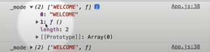
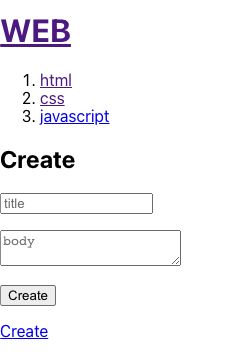

React 2022 개정판 - 생활코딩


# 1. 수업소개

- 리액트 문법을 사용하는 두가지 방법
  - Class 문법 사용
  - Function 문법 사용 - 최근에 많이 쓰는 방법 -> 이 수업에서 다루는 방법
- 리액트 : 사용자 정의 태그를 만드는 기술. 


# 2. 실습환경 구축

```javascript
npm start
// 개발환경 시작 
```


# 3. 소스코드수정방법


## 수정

- `index.js` : 프로그램의 입구
- `App.js` : index.js에 적용된 하위 단위
- `App.css`, `index.css` 
- `index.html`

## 배포

```javascript
// 개발환경 구축 (create-react-app 환경을 가져다가 . 현재 폴더에 적용)
npm create-react-app . 

// 개발환경을 ctrl+c 로 나간 후 배포준비
npm run build
```

- npm run build -> build 폴더 내 `index.html` 생성, 배포용이기때문에 공백이 모두 사라짐 (한줄)


```javascript
serve -s build
// serve : 웹서버
// -s : 사용자가 어떤 경로로 들어와도 index.html 파일을 서비스한다 
// build : build 폴더 내 index.html을 서비스 한다 
```


```javascript
npx serve -s build
// 웹서버 실행
```

- 명령 실행 후 나오는 주소로 들어가면 그것이 곧 개발용이 아니라 서비스용 파일을 접근한 것


# 4. 컴포넌트 만들기


```javascript
import logo from './logo.svg';
import './App.css';
function Header(){
  return <header>
    <h1><a href="/">React</a></h1>
  </header>
}
function Nav(){
  return <nav>
    <ol>
      <li><a href="/read/1">html</a></li>
      <li><a href="/read/2">css</a></li>
      <li><a href="/read/3">js</a></li>
    </ol>
  </nav>
}
function Article(){
  return <article>
    <h2>Welcome</h2>
    Hello, WEB
  </article>
}
function App() {
  return (
    <div>
      <Header></Header>
      <Nav></Nav>
      <Article></Article>
    </div>
  );
}

export default App;

```

- 리액트에서 사용자 정의 헤더(=컴포넌트) 는 무조건 대문자로 시작(ex. Header)
- 사용자 정의 헤더는 `function` 으로 만듦
- 한 컴포넌트를 수정하면 그것이 속한 모든 페이지가 바뀌는 파급적인 효과!
- 컴포넌트 이름으로 바로 알 수 있는 페이지의 목적!


# 5. props

- 우리가 만든 컴포넌트도 속성을 주고싶다. 마치 img 태그처럼 
- 리액트에서 속성은 prop

```javascript
import logo from './logo.svg';
import './App.css';
function Header(props){
  console.log('props', props, props.title)
  return <header>
    <h1><a href="/">{props.title}</a></h1>
  </header>
}
function Nav(){
  return <nav>
    <ol>
      <li><a href="/read/1">html</a></li>
      <li><a href="/read/2">css</a></li>
      <li><a href="/read/3">js</a></li>
    </ol>
  </nav>
}
function Article(props){
  return <article>
    <h2>{props.title}</h2>
    {props.body}
  </article>
}
function App() {
  return (
    <div>
      <Header title="REACT"></Header>
      <Nav></Nav>
      <Article title="Welcom" body="Hello, WEB"></Article>
      <Article title="Hi" body="Hello, React"></Article>
    </div>
  );
}

export default App;

```

- 컴포넌트에 `title`, `body` 같은 사용자 정의 속성을 추가하고, 이걸 컴포넌트 생성 함수의 매개변수로 받아 {} 사이 표현식에 넣어 사용 가능 


```javascript
import logo from './logo.svg';
import './App.css';
function Header(props){
  console.log('props', props, props.title)
  return <header>
    <h1><a href="/">{props.title}</a></h1>
  </header>
}
function Nav(props){
  const lis = []
  for(let i=0; i<props.topics.length; i++){
    let t = props.topics[i];
    lis.push(<li key={t.id}><a href={'/read/'+t.id}>{t.title}</a></li>)
  }
  return <nav>
    <ol>
      {lis}
    </ol>
  </nav>
}
function Article(props){
  return <article>
    <h2>{props.title}</h2>
    {props.body}
  </article>
}
function App() {
  const topics = [
    {id:1, title:'html', body:"html is ..."},
    {id:2, title:'css', body:"css is ..."},
    {id:3, title:'javascript', body:"javascript is ..."}
  ]
  return (
    <div>
      <Header title="WEB"></Header>
      <Nav topics={topics}></Nav>
      <Article title="Welcom" body="Hello, WEB"></Article>
    </div>
  );
}

export default App;

```

- `Nav()` 에 하드코딩으로 `<li>` 를 세개 주는것보다, 변수로 선언해서 돌리고 싶다!
- `topics` 변수 선언 후 컴포넌트에 {} 표현식으로 변수 전달
- 컴포넌트 생성 함수 내에서 반복하며 돌기 가능
- 동적으로 생성된 태그의 경우 `key` 태그를 유니크하게 줘야 리액트가 구분할 수 있음 (안그럼 에러남)


# 6. 이벤트

- 리액트에서 사용하는 html 문법은 실제 html이 아니고 유사 html임. 문법 스펠링들이 조금씩 다름. 예를들어 `onclick`이 아니고 `onClick`, `onClick` 다음에 문자열로 함수를 호출하는게 아니라 {function(){}}

```javascript
import logo from './logo.svg';
import './App.css';
function Header(props){
  console.log('props', props, props.title)
  return <header>
    <h1><a href="/" onClick={function(event){
      event.preventDefault(); // a 태그의 기본 동작을 방지한다. (클릭해도 reload가 일어나지 않음)
      props.onChangeMode();
    }}>{props.title}</a></h1>
  </header>
}
function App() {
  const topics = [
    {id:1, title:'html', body:"html is ..."},
    {id:2, title:'css', body:"css is ..."},
    {id:3, title:'javascript', body:"javascript is ..."}
  ]
  return (
    <div>
      <Header title="WEB" onChangeMode={()=>{ // arrow function 으로 전환 가능
        alert('Header');
      }}></Header>
      <Nav topics={topics}></Nav>
      <Article title="Welcom" body="Hello, WEB"></Article>
    </div>
  );
}

export default App;

```

- 태그 내에서 `onChangeMode={function(){}}` 을 사용하여 이벤트를 걸 수 있다.
- 태그 정의 내에서 `onClick` 이벤트시 수행되는 function의 매개변수로 `event` 객체를 받아온다. 
- `event.preventDefault()` : a 태그의 기본 동작을 방지한다. (클릭해도 reload가 일어나지 않음)
- 속성으로 준 `onChangeMode`가 수행될 수 있도록 한다.
- `function(){}` -> `()=>{}` 


```javascript
function Nav(props){
  const lis = []
  for(let i=0; i<props.topics.length; i++){
    let t = props.topics[i];
    lis.push(<li key={t.id}>
      <a id={t.id} href={'/read/'+t.id} onClick={(event)=>{
        event.preventDefault();
        props.onChangeMode(event.target.id);
      }}>{t.title}</a>
    </li>)
  }
  return <nav>
    <ol>
      {lis}
    </ol>
  </nav>
}
function App() {
  const topics = [
    {id:1, title:'html', body:"html is ..."},
    {id:2, title:'css', body:"css is ..."},
    {id:3, title:'javascript', body:"javascript is ..."}
  ]
  return (
    <div>
      <Header title="WEB" onChangeMode={()=>{
        alert('Header');
      }}></Header>
      <Nav topics={topics} onChangeMode={(id)=>{
        alert(id);
      }}></Nav>
      <Article title="Welcom" body="Hello, WEB"></Article>
    </div>
  );
}

export default App;

```

- Nav 태그에도 똑같이 이벤트를 걸어보자. 이번엔 id를 alert로 띄우고 싶다.
- `onChangeMode` 함수에 id를 매개변수로 전달한다
- Nav 태그 정의부에서 a 태그 `onClick` 이벤트시 `onChangeMode` 함수를 호출한다.
- a태그의 id를 `{t.id}` 로 설정하고 `event` 객체를 통해 가져온다. `target` 은 이벤트를 호출한 태그, 즉 a 태그이다.


# 7. state

- 리액트 컴포넌트중 하나.
- Prop(입력) -> 컴포넌트 -> return
- prop, state 모두 값이 변경되면 새로운 리턴값을 만들어 ui를 변경한다.
- Prop : 컴포넌트를 사용하는 외부자를 위한 자료
- state : 컴포넌트를 만드는 내부자를 위한 자료


- `useState` : 리액트에서 제공하는 기본 함수 훅
  - import {useState} from 'react'; 처럼 임포트 해서 사용해야 함

```javascript
const _mode = useState('WELCOME');
console.log('_mode', _mode);
```

- `useState` 의 인자는 해당 state의 초깃값
- `useState` 함수를 쓰면 `_mode` 변수를 state로 만들어줌
- 콘솔 찍어보면 `_mode` 함수는 배열임
- 

- 0번째는 상태의 값을 읽을 때, 1번째 데이터는 그 상태의 값을 변경할 때 사용하는 함수 

```javascript
// 각각 할당해줌
const mode = _mode[0];
const setMode = _mode[1];
```


```javascript
function App() {
  //const _mode = useState('WELCOME'); // 상태를 만들기 
  //const mode = _mode[0];
  //const setMode = _mode[1];
  const [mode, setMode] = useState('WELCOME');
  
  const topics = [
    {id:1, title:'html', body:"html is ..."},
    {id:2, title:'css', body:"css is ..."},
    {id:3, title:'javascript', body:"javascript is ..."}
  ]
  let content = null;
  if(mode === 'WELCOME'){
    content = <Article title="Welcom" body="Hello, WEB"></Article>;
  } else if(mode === 'READ'){
    content = <Article title="Welcom" body="Hello, Read"></Article>
  }
  return (
    <div>
      <Header title="WEB" onChangeMode={()=>{
        setMode('WELCOME'); // useState의 setMode를 쓰지 않고 그냥 mode = 'WELCOME' 으로 하면 안바뀜. 
      }}></Header>
      <Nav topics={topics} onChangeMode={(id)=>{
        setMode('READ');
      }}></Nav>
      {content}
    </div>
  );
}
```

- App 컴포넌트의 리턴값에서 `setMode` 가 아닌 그냥 `mode` 변수의 값을 변경만 수행하는 함수로 만든다면 클릭시 안바뀜. 왜? App 컴포넌트가 다시 실행되지 않아서.
- `setMode` 함수는 호출되면 App 컴포넌트가 다시 실행되고, const [mode, setMode] 라인에서 mode 변수가 다시 정의됨


```javascript
function Nav(props){
  const lis = []
  for(let i=0; i<props.topics.length; i++){
    let t = props.topics[i];
    lis.push(<li key={t.id}>
      <a id={t.id} href={'/read/'+t.id} onClick={(event)=>{
        event.preventDefault();
        props.onChangeMode(Number(event.target.id));
      }}>{t.title}</a>
    </li>)
  }
  return <nav>
    <ol>
      {lis}
    </ol>
  </nav>
}

function App() {
  const [mode, setMode] = useState('WELCOME');
  const [id, setId] = useState(null); // 초기값이 없다. html, css, javascript 중 어떤것이 선택되었는지 
  
  const topics = [
    {id:1, title:'html', body:"html is ..."},
    {id:2, title:'css', body:"css is ..."},
    {id:3, title:'javascript', body:"javascript is ..."}
  ]
  let content = null;
  if(mode === 'WELCOME'){
    content = <Article title="Welcome" body="Hello, WEB"></Article>;
  } else if(mode === 'READ'){
    let title, body = null;
    for(let i = 0; i < topics.length; i++){
      if(topics[i].id === id){
        title = topics[i].title;
        body = topics[i].body;
      }
    }
    content = <Article title={title} body={body}></Article>
  }
  return (
    <div>
      <Header title="WEB" onChangeMode={()=>{
        setMode('WELCOME');
      }}></Header>
      <Nav topics={topics} onChangeMode={(_id)=>{
        setMode('READ');
        setId(_id)
      }}></Nav>
      {content}
    </div>
  );
}

export default App;

```

- Nav를 클릭시마다 WELCOME, READ 문자가 아니라 해당 내용에 맞게 content를 변경하고 싶다.
- 그렇다면 어떤걸 클릭했는지에 대한 정보가 필요.
- `onChangeMode` 매개변수로 `_id`를 받는다.
- id 상태를 받는 변수를 `useState` 로 선언한다. 
- Nav 클릭시 발생하는 `onChangeMode` 에 `setId` 함수를 써서 id를 바꿔준다.
- 만약 id=2 인 li 태그가 클릭되면 -> `onChangeMode(2)` -> `setId(2)` -> `App()` -> const id = 2  세팅 -> 반복문 돌며 mode === 'READ' 일때 `topics` 의 id가 같은것의 title과 body로 Nav의 내용을 바꿈.


# 8. Create

```react
import logo from './logo.svg';
import './App.css';
import {useState} from 'react';

function Header(props){
  console.log('props', props, props.title)
  return <header>
    <h1><a href="/" onClick={(event)=>{
      event.preventDefault(); // a 태그의 기본 동작을 방지한다. (클릭해도 reload가 일어나지 않음)
      props.onChangeMode();
    }}>{props.title}</a></h1>
  </header>
}
function Nav(props){
  const lis = []
  for(let i=0; i<props.topics.length; i++){
    let t = props.topics[i];
    lis.push(<li key={t.id}>
      <a id={t.id} href={'/read/'+t.id} onClick={(event)=>{
        event.preventDefault();
        props.onChangeMode(Number(event.target.id));
      }}>{t.title}</a>
    </li>)
  }
  return <nav>
    <ol>
      {lis}
    </ol>
  </nav>
}
function Article(props){
  return <article>
    <h2>{props.title}</h2>
    {props.body}
  </article>
}
function Create(props){
  return <article>
    <h2>Create</h2>
    <form onSubmit={event=>{
      // form태그는 submit을 했을 때 reload가 되기 때문에 preventDefault 해줘야 함.
      event.preventDefault();
      // event.target : 이 이벤트가 발생한 타겟 => form 태그
      const title = event.target.title.value; // name이 title인 태그의 value
      const body = event.target.body.value; // name이 body인 태그의 value
      props.onCreate(title, body); // App() 내 onCreate() 함수가 호출됨
    }}>
      <p><input type="text" name="title" placeholder="title"/></p>
      <p><textarea name="body" placeholder="body"></textarea></p>
      <p><input type="submit" value="Create"></input></p>
    </form>
  </article>
}
function App() {
  //const _mode = useState('WELCOME'); // 상태를 만들기 
  //const mode = _mode[0];
  //const setMode = _mode[1];
  const [mode, setMode] = useState('WELCOME');
  const [id, setId] = useState(null); // 초기값이 없다. html, css, javascript 중 어떤것이 선택되었는지 
  const [nextId, setNextId] = useState(4);
  const [topics, setTopics] = useState([ // useState로 승격
    {id:1, title:'html', body:"html is ..."},
    {id:2, title:'css', body:"css is ..."},
    {id:3, title:'javascript', body:"javascript is ..."}
  ])
  let content = null;
  if(mode === 'WELCOME'){
    content = <Article title="Welcome" body="Hello, WEB"></Article>;
  } else if(mode === 'READ'){
    let title, body = null;
    for(let i = 0; i < topics.length; i++){
      if(topics[i].id === id){
        title = topics[i].title;
        body = topics[i].body;
      }
    }
    content = <Article title={title} body={body}></Article>
  } else if(mode ==='CREATE'){
    content = <Create onCreate={(_title, _body)=>{
      const newTopic = {id:nextId, title:_title, body:_body}
      setTopics(topics);
    }}></Create>
  }
  return (
    <div>
      <Header title="WEB" onChangeMode={()=>{
        setMode('WELCOME');
      }}></Header>
      <Nav topics={topics} onChangeMode={(_id)=>{
        setMode('READ');
        setId(_id)
      }}></Nav>
      {content}
      <a href="/create" onClick={event=>{
        event.preventDefault();
        setMode('CREATE');
      }}>Create</a>
    </div>
  );
}

export default App;

```



- Create 버튼을 누르면 title과 body를 받아 내용에 추가하고 싶다. 
- `{content}` 밑에 a태그로 `onClick` 펑션 추가. 다른 태그들이 `onChangeMode` 로 사용자 태그화 했던거랑 다르게 쌩 a 태그이므로 `onClick` 으로 함수 설정
- `a` 태그 클릭시 페이지가 리로드 되므로 `event.preventDefault()` 추가 
- `setMode('CREATE')` 로 mode 상태값을 바꿈
- mode가 CREATE 일때의 분기를 추가해 `content` 에 `<Create>`사용자 태그 추가
- `<Create>` 태그 내 `onCreate` 속성 추가하여 `title`, `body` 를 인자로 받아 기존의 `topics` 변수에 새로 만드는 값이 추가될 수 있도록 함.
- 기존의 `topics` 객체를 `useState`로 승격. 기존의 세 개의 json 이 들은 배열이 `topics` 의 초기값이 됨. 이후로 추가되는 건 `setTopics` 함수로.
- 새로 받은 값을 `newTopic` 로 선언 후 `setTopics` 로 상태를 변경. 안됨. 왜?

- 상태값을 만들 때 만드는 상태값이 primitive type 이라면 그냥 아래처럼 쓰면 됨

  - `const[value, setValue] = useState(PRIMITIVE);`

  - primitive : string, number, bigint, boolean, undefined, symbol, null

- 상태값이 Object(범 객체)라면? 처리방법이 달라짐. `topics` 는 json array라서 object임.

  - `const[value, setValue] = useState(Object);`

  - object, array

    1. newValue = [...value] => 데이터 복제. 중괄호에 ... 찍으면 value를 복제한 새로운 데이터가 newValue가 됨. 

    2. newValue 변경

    3. setValue(newValue)

    

```react
content = <Create onCreate={(_title, _body)=>{
    const newTopic = {id:nextId, title:_title, body:_body}
    const newTopics = [...topics]
    newTopics.push(newTopic);
    setTopics(newTopics);
  }}></Create>
```


```react
const[value, setValue] = useState([1]);
value.push(2);
setValue(value);
```

- React는 setValue를 호출했을 때 오리지널 데이터와 새로 들어온 데이터가 같은 데이터인지 확인하고, 같은 데이터면 굳이 컴포넌트를 다시 렌더링하지 않음. 위의 경우 같은 데이터(같은 배열)이기 때문에 렌더링이 안됨.

```react
const[value, setValue] = useState(1);
setValue(2);
```

- 2는 새로운 데이터기 때문에 오리지얼이었던 1과 다르기 때문에 렌더링이 됨. 
- 즉, 상태를 다룰 때 객체타입은 오리지널 데이터를 복제해서 복제한 데이터를 변경하고 그 데이터를 set한다.


```react
else if(mode ==='CREATE'){
  content = <Create onCreate={(_title, _body)=>{
      const newTopic = {id:nextId, title:_title, body:_body}
      const newTopics = [...topics]
      newTopics.push(newTopic);
      setTopics(newTopics);
      setMode('READ'); // 상세 페이지로 이동 
      setId(nextId);
      setNextId(nextId+1);
    }}></Create>
}
```

- 추가 뿐만 아니라 눌렀을 시 상세 페이지로 이동시키기 위해 `setMode('READ')`, `setId(nextId)` 를 수행해주고 `nextId` 에 1을 추가해줌.


# 9. Update

- update = create + read (hybrid)
- Update 링크를 클릭할 수 있게 만들어보자. 단, 홈으로 가는 WEB 버튼을 눌를땐 Update 링크가 안뜨고, 상세페이지일때만 뜨도록.

```react
import logo from './logo.svg';
import './App.css';
import {useState} from 'react';

function Header(props){
  console.log('props', props, props.title)
  return <header>
    <h1><a href="/" onClick={(event)=>{
      event.preventDefault(); // a 태그의 기본 동작을 방지한다. (클릭해도 reload가 일어나지 않음)
      props.onChangeMode();
    }}>{props.title}</a></h1>
  </header>
}
function Nav(props){
  const lis = []
  for(let i=0; i<props.topics.length; i++){
    let t = props.topics[i];
    lis.push(<li key={t.id}>
      <a id={t.id} href={'/read/'+t.id} onClick={(event)=>{
        event.preventDefault();
        props.onChangeMode(Number(event.target.id));
      }}>{t.title}</a>
    </li>)
  }
  return <nav>
    <ol>
      {lis}
    </ol>
  </nav>
}
function Article(props){
  return <article>
    <h2>{props.title}</h2>
    {props.body}
  </article>
}
function Create(props){
  return <article>
    <h2>Create</h2>
    <form onSubmit={event=>{
      // form태그는 submit을 했을 때 reload가 되기 때문에 preventDefault 해줘야 함.
      event.preventDefault();
      // event.target : 이 이벤트가 발생한 타겟 => form 태그
      const title = event.target.title.value; // name이 title인 태그의 value
      const body = event.target.body.value; // name이 body인 태그의 value
      props.onCreate(title, body); // App() 내 onCreate() 함수가 호출됨
    }}>
      <p><input type="text" name="title" placeholder="title"/></p>
      <p><textarea name="body" placeholder="body"></textarea></p>
      <p><input type="submit" value="Create"></input></p>
    </form>
  </article>
}
function Update(props){
  return <article>
    <h2>Update</h2>
    <form onSubmit={event=>{
      // form태그는 submit을 했을 때 reload가 되기 때문에 preventDefault 해줘야 함.
      event.preventDefault();
      // event.target : 이 이벤트가 발생한 타겟 => form 태그
      const title = event.target.title.value; // name이 title인 태그의 value
      const body = event.target.body.value; // name이 body인 태그의 value
      props.onUpdate(title, body); // App() 내 onCreate() 함수가 호출됨
    }}>
      <p><input type="text" name="title" placeholder="title" value={props.title}/></p>
      <p><textarea name="body" placeholder="body" value={props.body}></textarea></p>
      <p><input type="submit" value="Update"></input></p>
    </form>
  </article>
}
function App() {
  //const _mode = useState('WELCOME'); // 상태를 만들기 
  //const mode = _mode[0];
  //const setMode = _mode[1];
  const [mode, setMode] = useState('WELCOME');
  const [id, setId] = useState(null); // 초기값이 없다. html, css, javascript 중 어떤것이 선택되었는지 
  const [nextId, setNextId] = useState(4);
  const [topics, setTopics] = useState([ // useState로 승격
    {id:1, title:'html', body:"html is ..."},
    {id:2, title:'css', body:"css is ..."},
    {id:3, title:'javascript', body:"javascript is ..."}
  ])
  let content = null;
  let contextControl = null;
  if(mode === 'WELCOME'){
    content = <Article title="Welcome" body="Hello, WEB"></Article>;
  } else if(mode === 'READ'){
    let title, body = null;
    for(let i = 0; i < topics.length; i++){
      if(topics[i].id === id){
        title = topics[i].title;
        body = topics[i].body;
      }
    }
    content = <Article title={title} body={body}></Article>
    contextControl = <li><a href={"/update/"+id} onClick={event=>{
      event.preventDefault();
      setMode('UPDATE');
    }}>Update</a></li>;
  } else if(mode ==='CREATE'){
    content = <Create onCreate={(_title, _body)=>{
      const newTopic = {id:nextId, title:_title, body:_body}
      const newTopics = [...topics]
      newTopics.push(newTopic);
      setTopics(newTopics);
      setMode('READ'); // 상세 페이지로 이동 
      setId(nextId);
      setNextId(nextId+1);
    }}></Create>
  } else if(mode === 'UPDATE'){
    let title, body = null;
    for(let i = 0; i < topics.length; i++){
      if(topics[i].id === id){
        title = topics[i].title;
        body = topics[i].body;
      }
    }
    content = <Update title={title} body={body} onUpdate={(_title, _body)=>{

    }}></Update>
  }
  return (
    <div>
      <Header title="WEB" onChangeMode={()=>{
        setMode('WELCOME');
      }}></Header>
      <Nav topics={topics} onChangeMode={(_id)=>{
        setMode('READ');
        setId(_id)
      }}></Nav>
      {content}
      <ul>
        <li><a href="/create" onClick={event=>{
          event.preventDefault();
          setMode('CREATE');
        }}>Create</a></li>
        {contextControl}
      </ul>
    </div>
  );
}

export default App;

```


- mode가 READ 일때만 `contextControl` 에 update 태그 추가 
- update는 create와 비슷하지만, text와 body에 선택한 상세페이지의 기존 값이 디폴트로 떠있어야 함.
- mode가 UPDATE 일때 `<Update>` 태그를 추가, `title`, `body` 속성에 현재 선택된 상세내용의 title과 body를 전달한다. 
- `Update` 태그 정의부에서 받아온 속성 변수를 가지고 각각 속성의 value 값에 추가 `{props.title}`
- but, react에서 `props` 는 사용자가 컴포넌트로 전달한 일종의 명령이다. 수정을 할 수가 없다. props를 state로 환승해야 함. props는 외부자(사용자)가 내부로 전달하는 것. 그 값을 state로 바꿈. state는 내부자가 사용하는 것. 얼마든지 바꿀 수 있음. 

```react
function Update(props){
  const {title, setTitle} = useState(props.title); // props -> state로 환승
  const {body, setBody} = useState(props.body);
  return <article>
    <h2>Update</h2>
    <form onSubmit={event=>{
      // form태그는 submit을 했을 때 reload가 되기 때문에 preventDefault 해줘야 함.
      event.preventDefault();
      // event.target : 이 이벤트가 발생한 타겟 => form 태그
      const title = event.target.title.value; // name이 title인 태그의 value
      const body = event.target.body.value; // name이 body인 태그의 value
      props.onUpdate(title, body); // App() 내 onCreate() 함수가 호출됨
    }}>
      <p><input type="text" name="title" placeholder="title" value={title}/></p>
      <p><textarea name="body" placeholder="body" value={body}></textarea></p>
      <p><input type="submit" value="Update"></input></p>
    </form>
  </article>
}
```

- `{props.title}` -> `{title}`, `{props.body}` -> `{body}`
- 하지만, 그럼에도 불구하고 계속 안바뀜. 왜냐? 새로운 값 입력을 해도 `value={title}` 에서 연결되어있는 `title` 의 state가 바뀌지 않았기 때문.

```react
function Update(props){
  const [title, setTitle] = useState(props.title); // props -> state로 환승
  const [body, setBody] = useState(props.body);
  return <article>
    <h2>Update</h2>
    <form onSubmit={event=>{
      // form태그는 submit을 했을 때 reload가 되기 때문에 preventDefault 해줘야 함.
      event.preventDefault();
      // event.target : 이 이벤트가 발생한 타겟 => form 태그
      const title = event.target.title.value; // name이 title인 태그의 value
      const body = event.target.body.value; // name이 body인 태그의 value
      props.onUpdate(title, body); // App() 내 onCreate() 함수가 호출됨
    }}>
      <p><input type="text" name="title" placeholder="title" value={title} onChange={event=>{
        setTitle(event.target.value); 
      }}/></p>
      <p><textarea name="body" placeholder="body" value={body}></textarea></p>
      <p><input type="submit" value="Update"></input></p>
    </form>
  </article>
}
```

- `onChange` : html의 onchange와 다르게 동작. 리액트에선 값을 입력할때마다 호출됨.
- `onChange` 로 방금 우리가 입력함으로써 새로 바뀐 값(`event.target.value`)으로 다시 state를 바꿔줌

```react
function Update(props){
  const [title, setTitle] = useState(props.title); // props -> state로 환승
  const [body, setBody] = useState(props.body);
  return <article>
    <h2>Update</h2>
    <form onSubmit={event=>{
      // form태그는 submit을 했을 때 reload가 되기 때문에 preventDefault 해줘야 함.
      event.preventDefault();
      // event.target : 이 이벤트가 발생한 타겟 => form 태그
      const title = event.target.title.value; // name이 title인 태그의 value
      const body = event.target.body.value; // name이 body인 태그의 value
      props.onUpdate(title, body); // App() 내 onUpdate() 함수가 호출됨
    }}>
      <p><input type="text" name="title" placeholder="title" value={title} onChange={event=>{
        setTitle(event.target.value); 
      }}/></p>
      <p><textarea name="body" placeholder="body" value={body} onChange={event=>{
        setBody(event.target.value)
      }}></textarea></p>
      <p><input type="submit" value="Update"></input></p>
    </form>
  </article>
}
function App() {
  //const _mode = useState('WELCOME'); // 상태를 만들기 
  //const mode = _mode[0];
  //const setMode = _mode[1];
  const [mode, setMode] = useState('WELCOME');
  const [id, setId] = useState(null); // 초기값이 없다. html, css, javascript 중 어떤것이 선택되었는지 
  const [nextId, setNextId] = useState(4);
  const [topics, setTopics] = useState([ // useState로 승격
    {id:1, title:'html', body:"html is ..."},
    {id:2, title:'css', body:"css is ..."},
    {id:3, title:'javascript', body:"javascript is ..."}
  ])
  let content = null;
  let contextControl = null;
  if(mode === 'WELCOME'){
    content = <Article title="Welcome" body="Hello, WEB"></Article>;
  } else if(mode === 'READ'){
    let title, body = null;
    for(let i = 0; i < topics.length; i++){
      if(topics[i].id === id){
        title = topics[i].title;
        body = topics[i].body;
      }
    }
    content = <Article title={title} body={body}></Article>
    contextControl = <li><a href={"/update/"+id} onClick={event=>{
      event.preventDefault();
      setMode('UPDATE');
    }}>Update</a></li>;
  } else if(mode ==='CREATE'){
    content = <Create onCreate={(_title, _body)=>{
      const newTopic = {id:nextId, title:_title, body:_body}
      const newTopics = [...topics]
      newTopics.push(newTopic);
      setTopics(newTopics);
      setMode('READ'); // 상세 페이지로 이동 
      setId(nextId);
      setNextId(nextId+1);
    }}></Create>
  } else if(mode === 'UPDATE'){
    let title, body = null;
    for(let i = 0; i < topics.length; i++){
      if(topics[i].id === id){
        title = topics[i].title;
        body = topics[i].body;
      }
    }
    content = <Update title={title} body={body} onUpdate={(_title, _body)=>{
      const newTopics = [...topics]; 
      const updatedTopic = {id:id, title:_title, body:_body} // id는 READ를 실행하며 저장한 변수 Id
      for(let i = 0; i < newTopics.length; i++){
        if(newTopics[i].id === id){
          newTopics[i] = updatedTopic;
          break;
        }
      }
      setTopics(newTopics);
      setMode('READ');
    }}></Update>
  }
  return (
    <div>
      <Header title="WEB" onChangeMode={()=>{
        setMode('WELCOME');
      }}></Header>
      <Nav topics={topics} onChangeMode={(_id)=>{
        setMode('READ');
        setId(_id)
      }}></Nav>
      {content}
      <ul>
        <li><a href="/create" onClick={event=>{
          event.preventDefault();
          setMode('CREATE');
        }}>Create</a></li>
        {contextControl}
      </ul>
    </div>
  );
}

export default App;

```

- 이제 `Update` 컴포넌트에서 `onSubmit ` 을 통해 전달한 새로 수정한 title, body를 가지고 해당 topic의 내용물을 수정해야 함.
- mode가 UPDATE 일 때 속성인 `onUpdate` 함수 정의를 수정한다.
- 기존 변수 `topics` 를 복사해주고, 업데이트된 토픽 json을 만들어준다. (`updatedTopic`)
- 반복문을 돌며 현재 선택된 id와 일치하는 newTopics 인자를 `updatedTopic` 으로 갈아치운다.
- 수정된 `newTopics` 를 다시 `setTopics` 해주고 mode도 READ로 `setMode` 로 바꿔준다.


# 10. Delete

- 리액트에서는 태그를 쓸 때 하나의 태그만 가능. 그래서 `<></>` 이렇게 빈 태그로 묶어 여러 태그를 쓸 수 있게 해준다.

```react
contextControl = <><li><a href={"/update/"+id} onClick={event=>{
      event.preventDefault();
      setMode('UPDATE');
    }}>Update</a></li>
    <input type="button" value="Delete" onClick={event=>{
      const orgTopics = [...topics]
      const newTopics = []
      for(let i = 0; i < orgTopics.length; i++){
        if(orgTopics[i].id !== id){
          newTopics.push(orgTopics[i]);
        }
      }
      setTopics(newTopics);
      setMode('WELCOME');
    }}></input></>;
```

- `contextControl` 에 delete button 추가하고 `Delete` 컴포넌트 따로 만들 필요 없이 바로 `onClick` 으로 이벤트 걸음
- id에 해당하지 않는것만 새로 담아서 `setTopics`, `setMode(WELCOME)`. 


